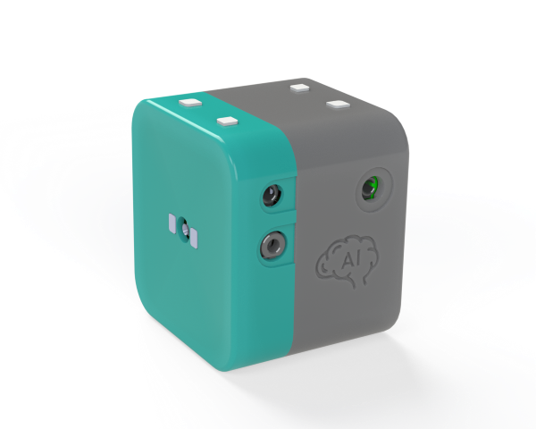
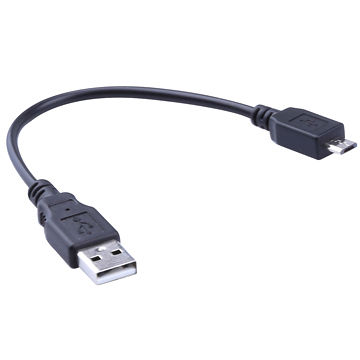

# Cats and Dogs Demo on the MAXREFDES178# Cube Camera

## List of MAXREFDES178# Components

Before beginning, make sure you have all of the following components.

  * MAXREFDES178# Cube Camera with enclosure.

    Front - Right Side (LCD, USB-C Socket, SD Card Socket) | Back - Left Side (Camera, Audio Jacks) 
    :-------------------------:|:-------------------------:
     |  

  * MAXDAP-TYPE-C Pico adaptor.

    

  * MAX32625PICO Debugger with ribbon SWD cable.

    

  * 2 x USB-A to USB-Micro-B cables.

    

  * USB-A to USB-C cable.

    

     

## Building Firmware, Loading and Debugging

Please refer to main Cube Camera repo for instructions how to build, and load firmware:

https://github.com/MaximIntegratedAI/refdes/blob/develop/README.md

NOTE: Cats and Dogs demo does not support Android application.

## Testing Cats and Dogs Demo

After loading all 3 components of Cats and Dogs Demo (MAX32666, MAX78000_video and MAX78000_audio), turn on the cube camera:

- Plug a USB-C cable to charge the device.

- Press power button for 1 seconds to turn on the device.

- Power LED will start blinking blue.

- Maxim logo, BLE MAC, serial number and firmware version will appear on the LCD.
  
  

- Device will start with pressing Start Video

- Keyword Spotting is enabled and the detected words are displayed on the top. However, **voice commands are disabled** in this demo. Following words are detected:

  - ['up', 'down', 'left', 'right', 'stop', 'go', 'yes', 'no', 'on', 'off', 'one', 'two', 'three', 'four', 'five', 'six', 'seven', 'eight', 'nine', 'zero'].

- The images are captured at 250msec interval and categorized as Cat or Dog:

  

