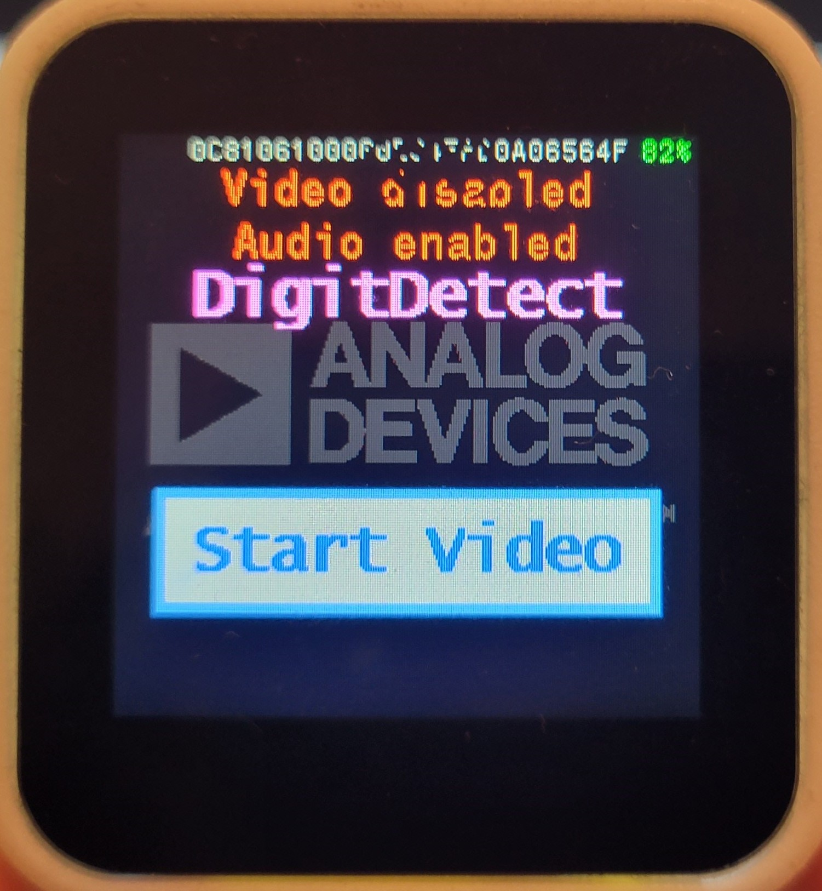
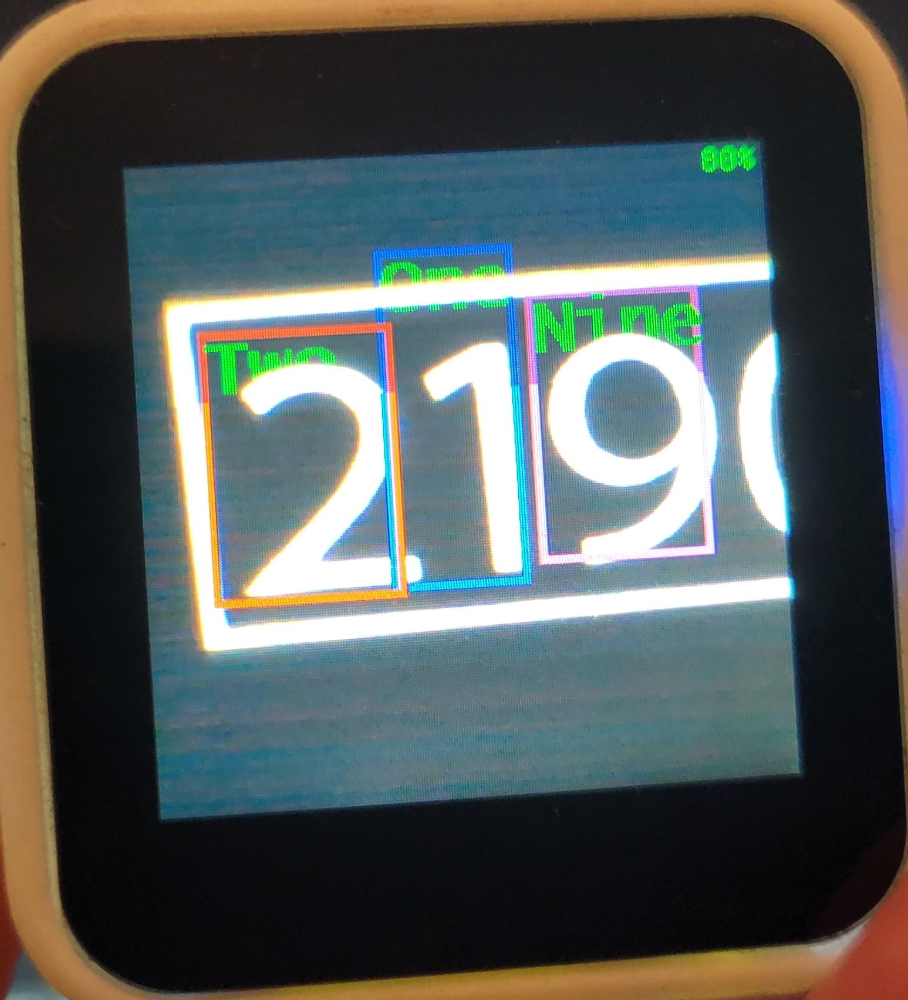

# Digit Detection Demo on the MAXREFDES178# Cube Camera

## Getting Started with MAXREFDES178, Building Firmware, Loading and Debugging

Please refer to main MAXREFDES178 documentation for instructions how to build, and load firmware:

[Getting Started with the MAXREFDES178# Cube Camera](./../maxrefdes178_doc/README.md)

NOTE: This demo does not support Android application.

## Testing DigitDetect Demo

This demo shows a tiny SSD network, trained to localize and recognize digits in images.

After loading all 3 components of DigitDetect Demo (MAX32666, MAX78000_video and MAX78000_audio), turn on the cube camera:

- Plug a USB-C cable to charge the device.

- Press power button for 1 seconds to turn on the device.

- Power LED will start blinking blue.

- Analog Devices logo, BLE MAC, serial number and firmware version will appear on the LCD.
  
  

- Device will start with pressing "Start Video"

- Keyword Spotting is enabled and the detected words are displayed on the top. However, **voice commands are disabled** in this demo. Following words are detected:

  - ['up', 'down', 'left', 'right', 'stop', 'go', 'yes', 'no', 'on', 'off', 'one', 'two', 'three', 'four', 'five', 'six', 'seven', 'eight', 'nine', 'zero', 'cube'].

- The application recognizes digits in captured image and draws a color box around them

  

  
