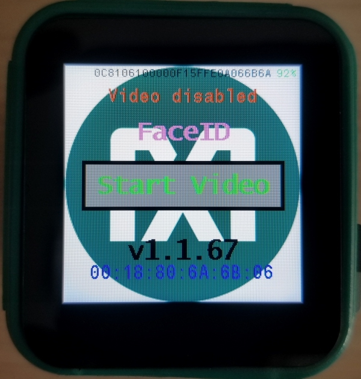
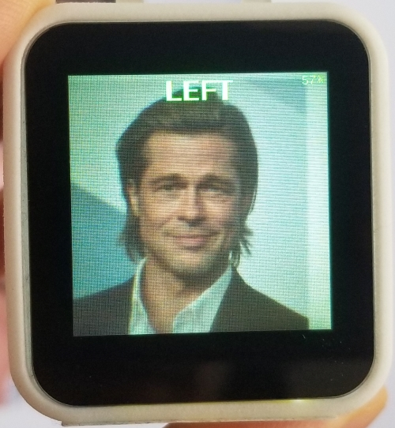
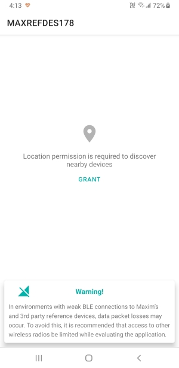
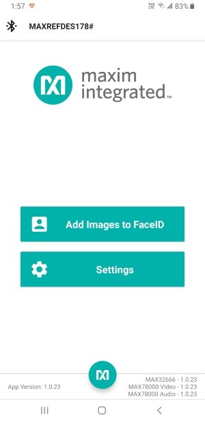
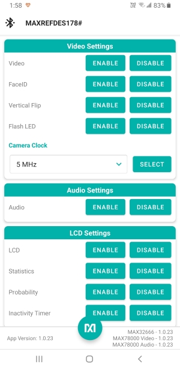
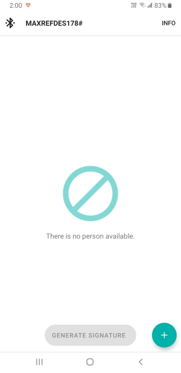
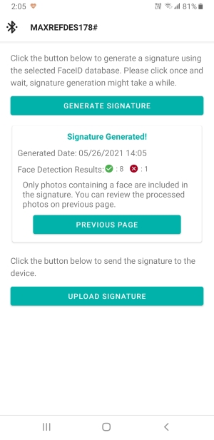
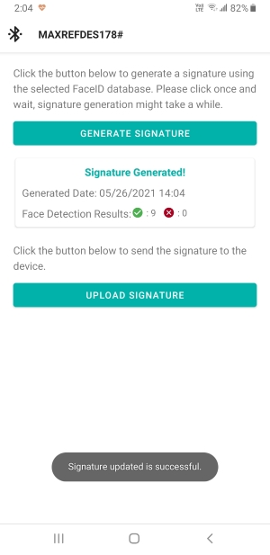

# FaceID Demo on the MAXREFDES178# Cube Camera

## Getting Started with MAXREFDES178, Building Firmware, Loading and Debugging

Please refer to main MAXREFDES178 documentation for instructions how to build, and load firmware:

[Getting Started with the MAXREFDES178# Cube Camera](./../maxrefdes178_doc/README.md)

### MAXREFDES178# FaceID Demo Firmware Getting Started

- Plug in a USB-C cable to charge the device.

- Press the power button for one second to turn on the device.

- The power LED will start blinking blue.

- The Maxim logo, BLE MAC, serial number and firmware version will appear on the LCD.
  
  

- The device will start with:

  - Video and FaceID in disabled state.
  - Audio and KWS20 (keyword spotting) in enabled state.

- KWS20 classification results will appear on top of the LCD.

  - KWS20 keywords are: [‘up’, ‘down’, ‘left’, ‘right’, ‘stop’, ‘go’, ‘yes’, ‘no’, ‘on’, ‘off’, ‘one’, ‘two’, ‘three’, ‘four’, ‘five’, ‘six’, ‘seven’, ‘eight’, ‘nine’, ‘zero’].
  - The KWS20 classification result text changes color according to the KWS20 classification confidence:
    - Red → Unknown keyword, or when voice commands are disabled.
    - Green → Keyword detected with high confidence
    
  
  
- The ‘On’ & ‘Off’ voice commands (when recognized with high confidence) enable / disable the LCD.

- Touch the “Start Video” button on the LCD to start video capture.

- The ‘Go’ and ‘Stop’ voice commands (when recognized with high confidence) enable / disable FaceID.

- Use Button B to disable/enable voice commands.

- The FaceID frame appears in the center of the LCD when FaceID is enabled:
  
  FaceID Disabled | FaceID Enabled
  :-------------------------:|:-------------------------:
   |  

- FaceID classification results appear on bottom of the LCD.

  - The Celebrity FaceID database is the default FaceID database.
  - Celebrity FaceID database subjects are: [‘AshtonKutcher’, ‘BradPitt’, ‘CharlizeTheron’, ‘ChrisHemsworth’, ‘MilaKunis’, ‘ScarlettJohansson’]
  - FaceID classification result text, FaceID frame and Video LED (LED A) change color according to FaceID classification confidence:
    - Red → Unknown subject
    - Yellow → Subject detected with low confidence
    - Green → Subject detected with high confidence
  - Point the camera to any celebrity photo and center the FaceID frame to celebrity’s face.

- The battery state of charge (SOC) is shown right top corner of the LCD. SOC changes color according to charge state:

  - Red → SOC is below 10%.
  - Green → SOC is above 10%.
  - Orange → USB-C is connected and battery is charging.

- Button behavior:

  

  - A short press (1 second) on power button disables video and navigates to startup screen.
  - A long press (4 seconds) on power button turns off the device.
  - Button X enables / disables device statistics on LCD. Device statistics are:
    - LCD frames per second.
    - FaceID duration (MAX78000 Video CNN + embedding calculation) in milliseconds.
    - KWS20 duration (MAX78000 Audio CNN) in microseconds.
    - Video camera (frame) capture duration in milliseconds.
    - Video communications duration (frame transfer from MAX78000 to MAX32666 over QSPI).
    - MAX78000 Video power consumption in milliwatts (VREGI + VCOREA = Input supply + CNN active supply).
    - MAX78000 Audio power consumption in milliwatts (VREGI + VCOREA = Input supply + CNN active supply).
    - FaceID embeddings database subject names:
    
      
    
  - Button Y changes the second debug channel target of the Type-C connector. Second debug channel targets are:
    - MAX32666 Core1
    - MAX78000 Video
    - MAX78000 Audio
  - Button A enables / disables the video Flash LED.
  - Button B enables / disables the voice commands.
  
- If the inactivity timer is enabled (enabled by default):

  - After 1 minute of inactivity, LCD backlight is dimmed automatically.
  - After 2 minutes of inactivity, LCD and MAX78000 Video are disabled automatically.
  - The inactivity timer is reset when:
    - Motion is detected (using the accelerometer).
    - A KWS20 classification is detected.
    - A FaceID classification is detected.
    - Any button is pressed.
    - The LCD is touched.
    - When USB is connected.
    - When BLE is connected or any BLE command is received.

- The Power LED turns solid blue when a BLE peer is connected.

### MAXREFDES178# FaceID Demo Android Application

The remaining steps requires an Android device. Currently, ARM 64-bit devices and (arm64-v8a) Android versions from 7 to 11 are supported.

- Install the MAXREFDES178# Android application from Google Play: https://play.google.com/store/apps/details?id=com.maximintegrated.maxcamandroid

- Enable BLE on the Android device.

- Open the MAXREFDES178# Android application. Accept the license agreement and grant required access if you are using the app for the first time:
  
    
  
- Select your MAXREFDES178# BLE MAC address on the BLE scan page to connect to MAXREFDES178#. You can find your device BLE MAC address by short pressing (for 1 second) on the power button:
  
  
  
- The connected MAXREFDES178# device firmware version will be shown right left corner:
  
  

#### Change MAXREFDES178# demo settings using the Android Application

- Navigate to the settings page to change demo settings.

- Video capture can be enabled / disabled.

- FaceID can be enabled / disabled.

- Video capture vertical flip for selfie adaptor can be enabled / disabled.

- The video flash LED can be enabled / disabled.

- Camera clock can be set to 5 MHz, 10 MHz, or 15 MHz. 

- Audio (KWS20) can be enabled / disabled.

- The LCD can be enabled / disabled.

- Device statistics on LCD can be enabled / disabled.

- The KWS20 classification probability display on LCD can be enabled / disabled.

- The inactivity timer can be enabled / disabled.

- The second debug channel target can be changed.

- The FaceID signature can be reset to default (after user approval).

- The device can be restarted (after user approval).

- The device can be shut down (after user approval).
  
   

#### Generate and upload a new FaceID database to MAXREFDES178# using the Android Application

- Navigate to the FaceID page.

  

- Click the ‘+’ icon on the right bottom corner to create a new FaceID database:
  
   

- Click the ‘+’ icon on the right bottom corner to add a new person (subject) to the database.
  
  - A maximum of six subjects is allowed.

    
  
- Click the ‘+’ icon under the subject name to add a new face photo to the subject.
  - Photos can be added using the camera or from the file system.
  - Photos can be cropped.
  - A maximum of eight photos is allowed.
  
  

- Click the ‘INFO’ button on the top right corner for more information about FaceID photo guidelines.
  
   

- When you complete adding new subjects and photos, click the ‘GENERATE/UPLOAD SIGNATURE’ button to generate and upload new FaceID signatures to the connected MAXREFDES178#.
  
   

- Click the ‘GENERATE SIGNATURE’ button to generate a signature from the database.

  - Only the photos containing a face are included in the signature. Face detection result will be shown after signature is generated.
  
   

  - If face is detected in any photo, you can review the photos by pressing the previous page button.

  

  - Good/Bad photos will be indicated by :heavy_check_mark:/:x: marks in previous page.

  

- Click the ‘UPLOAD SIGNATURE’ button to upload a FaceID signature to the MAXREFDES178#. (after user approval)
  
   

- A notification on MAXREFDES178# will appear if the signature update is successful.
  
  

