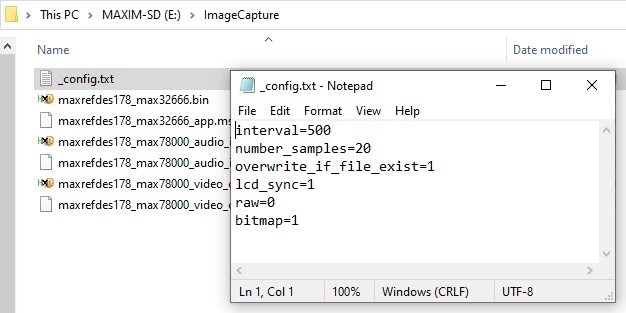
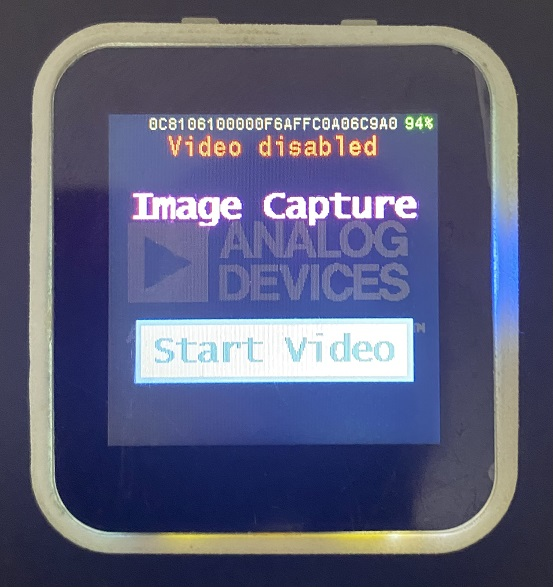
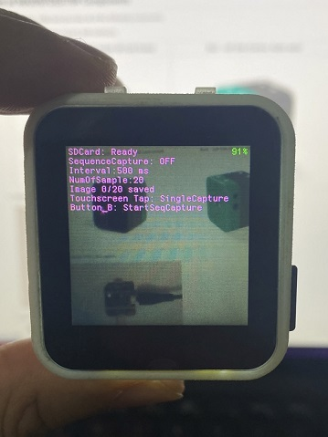
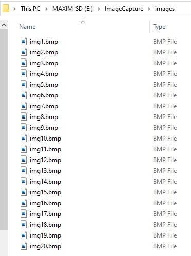

# Image Capture Demo on the MAXREFDES178# Cube Camera

## Getting Started with MAXREFDES178, Building Firmware, Loading and Debugging

Please refer to main MAXREFDES178 documentation for instructions how to build, and load firmware:

[Getting Started with the MAXREFDES178# Cube Camera](./../maxrefdes178_doc/README.md)

## Testing Image Capture Demo

After loading all 3 components of Cats and Dogs Demo (MAX32666, MAX78000_video and MAX78000_audio), turn on the cube camera:

- Prepare and put a _config.txt file in ImageCapture folder in SDCard

  
  
  **Config file parameters**:	
  
 | **Parameter**            | **Description**                                                   |
 | -------------------------| ------------------------------------------------------------------|
 | interval	                | Image capture interval, resolution milisecond					    |
 | number_samples	        | Required number of sample					              			|
 | overwrite_if_file_exist  | Set it to 1 to overwrite image in case of same file exist in the image folder               |
 | lcd_sync                 | Can be set to 1 or 0. If it set to 0 image will be capture more fast but display will blink |
 | raw               		| Store image as raw format, no image header 						|
 | bitmap			        | Store image as bitmap format				 						|
 
- Plug a USB-C cable to charge the device.

- Press power button for 1 seconds to turn on the device.

- Power LED will start blinking blue.

- Maxim logo, BLE MAC, serial number and firmware version will appear on the LCD.
  
  

- Device will start with pressing Start Video

- Tap touchscreen for manual capture and use Button B for start sequence capture

  
  
  In sequence capture mode "Seqeunce Capture" label on display indicate whether sequence mode ON of OFF. Use Button B to start sequence capture mode.
  "Image n/m saved" indicates last image number saved in SD Card.
  
  During each image capture Button B green LED will blink to indicate status.
  
- The images are captured will store in ImageCapture/images folder in SD Card:

  
