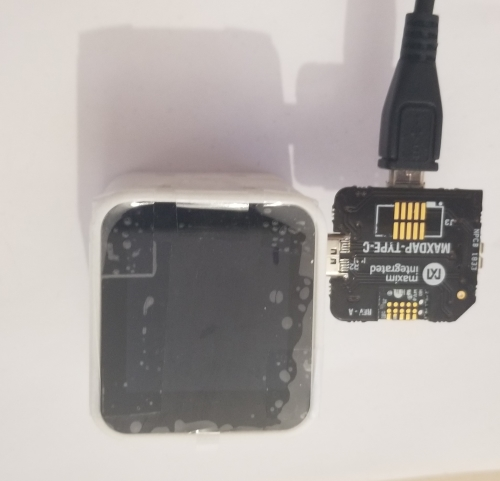
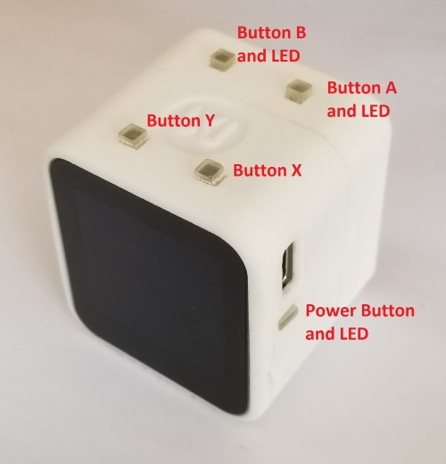

## Description

This example demonstrates some of the features of Maxim's Cube Camera evaluation kit. Specifically, audio data is read from WAV files stored on a MircoSD card and played back through the audio jack.

## Building the Example

To create the necessary executable files for this example navigate to both the *WavFile_Processor* and *Audio_Processor* directories in a terminal window and execute the following command:

```
make release
```

## Loading the Example

Loading the example requires two steps: loading the executable from the *WavFile_Processor* build to the MAX32666 and loading the executable from the *Audio_Processor* build to the MAX78000.

First, connect a MAXDAP-TYPE-C Pico adapter to the USB-C port on the side of the Cube Camera with the pico board oriented away from the screen as seen in the image below.

  * MAXDAP-TYPE-C Pico adaptor oriented away from the screen.

    

Next, navigate to the *WavFile_Processor* directory in a terminal window and enter the following commands:

```
openocd -s ${TOOLCHAIN_PATH}/OpenOCD/scripts -f interface/cmsis-dap.cfg -f target/max32665_nsrst.cfg -c "init;halt;max32xxx mass_erase 0;exit"
openocd -s ${TOOLCHAIN_PATH}/OpenOCD/scripts -f interface/cmsis-dap.cfg -f target/max32665_nsrst.cfg -c "program build/max32665.bin verify reset exit 0x10000000"
```

Upon succesful completion of loading the MAX32666 executable, reverse the orientation of the MAXDAP-TYPE-C Pico adapter so that the Pico board is facing the same direction as the screen (as seen below) and navigate to the *Audio_Processor* directory.

  * MAXDAP-TYPE-C Pico adaptor oriented toward the screen.

    

Enter the following command:

```
openocd -s ${TOOLCHAIN_PATH}/OpenOCD/scripts -f interface/cmsis-dap.cfg -f target/max78000_nsrst.cfg -c "program build/max78000.bin verify reset exit 0x10000000"
```

NOTE!: The device may need to be power cycled after loading the executables. Do this by holding down the power button until the LEDs turn off and then plugging the camera back in.

## Running/Using the Example

For reference:

  * MAXDAP-TYPE-C Pico adaptor oriented toward the screen.

    

##### Setting up the Device

Ensure the MicroSD card is set up properly. First check that the SD card is formatted as a FAT filesystem. If it is not, it can be formatted using your host machine or by running the SDHC\_FAT example on a MAX32665/66 EV Kit. Next load the WAV files onto the SD card in the root directory. If you have your own WAV files you wish to use verify that the sampling rate is less than 48kHz and the sample width is less than 16 bits. Additionally, if you use your own WAV files you'll have to change the filenames on lines 143-146 of *WavFile_Processor/main.c* and the value of "NUM\_FILES" on line 27 of *WavFile_Processor/include/audio_processor.h*. However if you do not have your own WAV files, the example has been set up to use the WAV files provided in the *doc* folder.

Next, insert the MicroSD card into the MicroSD card slot located next to the Power Button with the notch on the MicroSD card pointing towards the top of the Cube Camera. Additionally, insert headphones into the audio jack closest to Button B.

##### Running the Example

For practical purposes, the device operates in two states: keyword spotting and audio playback. These states are indicated through Button B's and the Power Button's status LEDs. When in the keyword spotting state, Button B's LED will appear magenta and the Power Button's LED will appear red. When in the audio playback state, both status LEDs will appear green. Note that when the device is in audio playback state it is unable to process audio commands.

Begin by waiting for the device to enter the keyword spotting state, this should happen almost immediately. Once the device is in this state use the commands "GO", "LEFT" and "RIGHT" to control which audio track will be played back. "GO" plays the current track, "LEFT" plays the previous track, and "RIGHT" plays the next track.

Once a command is received, the device will enter the audio playback state as indicated by the status LEDs and the audio output through the headphones. The device will stay in the audio playback state until either Button B is pressed or the audio track has finished, at which point the device returns to the keyword spotting state.