# Getting Started with the MAXREFDES178# Cube Camera

## List of MAXREFDES178# Components

Before you begin, make sure you have all of the following components:

  * MAXREFDES178# Cube Camera with enclosure.

    Front - Right Side (LCD, USB-C Socket, SD Card Socket) | Back - Left Side (Camera, Audio Jacks) 
    :-------------------------:|:-------------------------:
     |  

  * MAXDAP-TYPE-C Pico adaptor.

    

  * MAX32625PICO Debugger with ribbon SWD cable.

    

  * 2 x USB-A to USB-Micro-B cables.

    

  * USB-A to USB-C cable.

    

  * Android Device. 


## Schematic

The schematic and BOM can be found in the MAXREFDES178# Datasheet. See https://www.maximintegrated.com/products/MAXREFDES178

## Powering Up the MAXREFDES178# for the First Time

[](https://github.com/MaximIntegratedAI/refdes/actions/workflows/maxrefdes178.yml)

- *Some* units have a protective film installed covering the camera. Remove the film:

  

- Plug in a USB-C cable to charge the device.

- Press the power button for one second to turn on the device.

- The MAXREFDES178# comes with a preloaded FaceID demo application.

- The power LED will start blinking blue.

  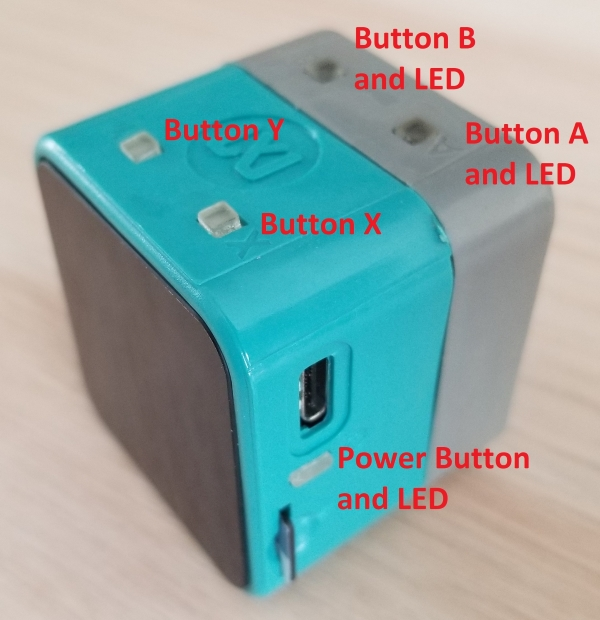

- The Maxim logo, BLE MAC, serial number and firmware version will appear on the LCD.
  
  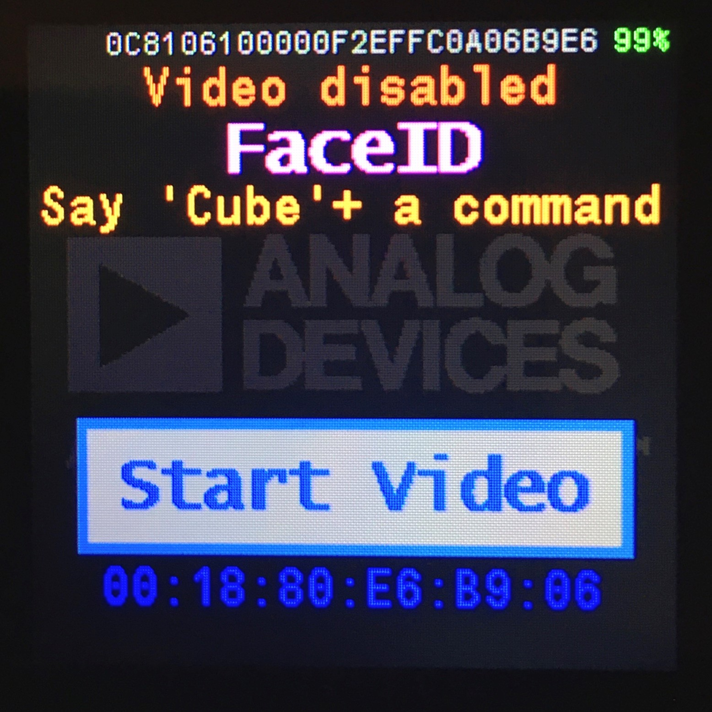

- Please refer to FaceID Demo page for preloaded demo details:

  - [FaceID Demo on the MAXREFDES178# Cube Camera](./../maxrefdes178-FaceId/)

- Other available MAXREFDES178# demo pages:

  - [Cats and Dogs Demo on the MAXREFDES178# Cube Camera](./../maxrefdes178-CatsDogs/)

  - [UNet Demo on the MAXREFDES178# Cube Camera](./../maxrefdes178-UNet/)

  - [WildLife Demo on the MAXREFDES178# Cube Camera](./../maxrefdes178-WildLife/)

## Build Demo Firmware using MINGW on Windows

### Install Maxim SDK

You will need to download and install the Maxim SDK on a Windows 10 host. The Maxim SDK is available here:

https://www.maximintegrated.com/content/maximintegrated/en/design/software-description.html/swpart=SFW0010820A

On Windows, the MSYS shell (included in the SDK) can be used to build examples. Start `msys.bat` to launch the shell. The shell can be accessed from the Windows Start Menu or in the default installation directory show below:


### Download the MAXREFDES178# Demo Repo

Download MAXREFDES178# from GitHub with submodules:

```
 git clone --recurse-submodules git@github.com:MaximIntegratedAI/refdes.git
```


**WARNING:** **Put the refdes directory close to the root of the drive. Long Windows paths may cause failed builds.**

There are multiple demos for MAXREFDES178. Each demo codebase has its own directory. MAXREFDES178 common files are in top directory. 

Repo folder structure:

- `external`:
  - External drivers, modules and binaries.
- `maxrefdes178_common`:
  - MAX32666, MAX78000 Video and MAX78000 Audio firmware common headers and source files.
- `maxrefdes178_doc`:
  - Markdown documentation files.
- `maxrefdes178-AppSwitcher`:
  - MAX32666 bootloader firmware source files.
  - MAX32666 bootloader firmware Eclipse project files.
  - MAX32666 bootloader binary.
  - MAX78000 bootloader binary.
- `maxrefdes178-demo/maxrefdes178_android`:
  - Android application source files.
  - Android Studio project files.
- `maxrefdes178-demo/maxrefdes178_max32666`:
  - MAX32666 firmware source files.
  - MAX32666 firmware Eclipse project files.
- `maxrefdes178-demo/maxrefdes178_max78000_common`:
  - MAX78000 Video and MAX78000 Audio firmware common headers and source files.
- `maxrefdes178-demo/maxrefdes178_max78000_audio`:
  - MAX78000 Audio firmware source files.
  - MAX78000 Audio firmware Eclipse project files.
- `maxrefdes178-demo/maxrefdes178_max78000_video`:
  - MAX78000 Video firmware source files.
  - MAX78000 Video firmware Eclipse project files.

### Build MAXREFDES178# Demo Firmware

- All MAXREFDES178# demos are in different subfolders.  

- cd into one of the demo directories.
  
  

#### Build MAX32666 Firmware

- Open MinGW MSYS shell.

- cd into  `maxrefdes178_max32666` directory.

- Run make:
  ```
  make -r -j
  ```
  
  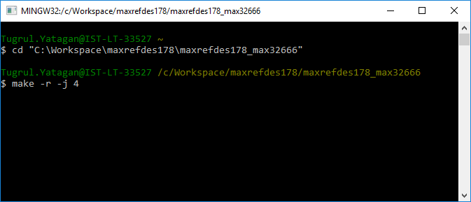

- A `build\maxrefdes178_max32666.bin` firmware binary should be generated.

**WARNING:** 

**1- If during the build, MinGW MSYS shell stopped with memory commit error, run the make again and it will continue the build.**

```bash
*** couldn't commit memory for cygwin heap, Win32 error 0
```

**2- If you get the following error during build, put MAXREFDES178# directory closer to the root of the drive. Long Windows paths cause failed builds:**

```bash
collect2.exe: fatal error: CreateProcess: No such file or directory
or
/bin/sh: line 15: /g/MaximSDK/Tools/GNUTools/bin/arm-none-eabi-gcc: Bad file number
```

#### Build MAX78000 Audio Firmware

- Open MinGW MSYS shell.
- cd into the `maxrefdes178_max78000_audio` directory.
- Run make:
  ```
  make -r -j
  ```
  
  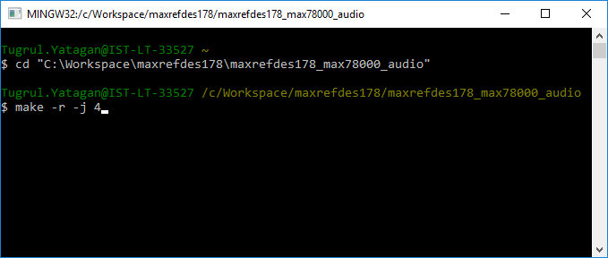

- A `build\maxrefdes178_max78000_audio.bin` firmware binary should be generated.

#### Build MAX78000 Video Firmware

- Open MinGW MSYS shell.
- cd into the `maxrefdes178_max78000_video` directory.
- Run make:
  ```
  make -r -j
  ```
  
  

- A `build\maxrefdes178_max78000_video.bin` firmware binary should be generated.

### Build MAXREFDES178# Demo Android Application

- Download and install Android Studio: https://developer.android.com/studio

- Install Android 9 Android SDK from Android Studio SDK manager.

- Click File→Open and select the `maxrefdes178-FaceId\maxrefdes178_android` directory.

- Build the project.

  **Warning:** The MAXREFDES178# Android Application uses Chaquopy Python SDK for running Python scripts. Chaquopy requires a License for commercial use.

## Load Demo Firmware using MINGW on Windows

**WARNING:** If you are programming a board that already has MAX78000 Video and MAX78000 Audio firmware, make sure video (FaceID) and audio (KWS) are enabled and running. Start programming MAX78000 Video and MAX78000 Audio firmware first, then MAX32666. MAX78000 Video and MAX78000 Audio firmware go to sleep mode when disabled, which causes interruptions during programming.

- Applications are loaded and run using OpenOCD. This section shows how to do this specifically with MSYS on Windows.

- Connect a USB-Micro-B cable to the MAXDAP-TYPE-C Pico adaptor HDK debugger (Pico) port. The Pico on the adaptor must be programmed with the [max32625pico_max32630hsp.bin](https://os.mbed.com/teams/MaximIntegrated/wiki/MAX32625PICO-Firmware-Updates) DAPLINK image.

  
  
- To load local builds (the binaries that you build on your pc):

  - Open MinGW console and cd into one of the demo directory:

    

- To load prebuilded binaries:

  - Download latest maxrefdes178_firmware.zip release and extract the content of the zip file.

    - https://github.com/MaximIntegratedAI/refdes/releases for stable releases.
    - https://github.com/MaximIntegratedAI/refdes/actions/workflows/maxrefdes178.yml for GitHub Action builds.

  - Open MinGW console, cd into the directory where zip is extracted and cd into one of the demo directory:

    


### Load MAX32666 Firmware

- Insert the MAXDAP-TYPE-C Pico adaptor board into MAXREFDES178# MAX32666 (first debug channel). The MAXDAP-TYPE-C Pico adaptor and MAXREFDES178# LCD should face opposite directions:
  
  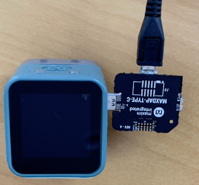

  **WARNING: Connecting Pico adaptor with wrong direction may cause the MAX32666 to become unresponsive and may require to open the camera and use the procedure described later to recover.**
  
- Program MAX32666 firmware using provided script: 

  ```bash
  $ run.sh
  ```
  
  NOTE: The script will start openocd with following commands to update the firmware:
  
  ```bash
  openocd -s ${TOOLCHAIN_PATH}/OpenOCD/scripts -f interface/cmsis-dap.cfg -f target/max32665_nsrst.cfg -c "init;halt;max32xxx mass_erase 0;exit"
  openocd -s ${TOOLCHAIN_PATH}/OpenOCD/scripts -f interface/cmsis-dap.cfg -f target/max32665_nsrst.cfg -c "program maxrefdes178_max32666/build/maxrefdes178_max32666.bin verify reset exit 0x10000000"
  ```
  
- Successful MAX32666 firmware update output:
  
  

- Press the ‘Y’ button to change the second debug channel to either MAX78000 Video or MAX78000 Audio.

- A notification at the bottom of the LCD will show the selected target:

MAX78000 Video Debug Select | MAX78000 Audio Debug Select 
:-------------------------:|:-------------------------:
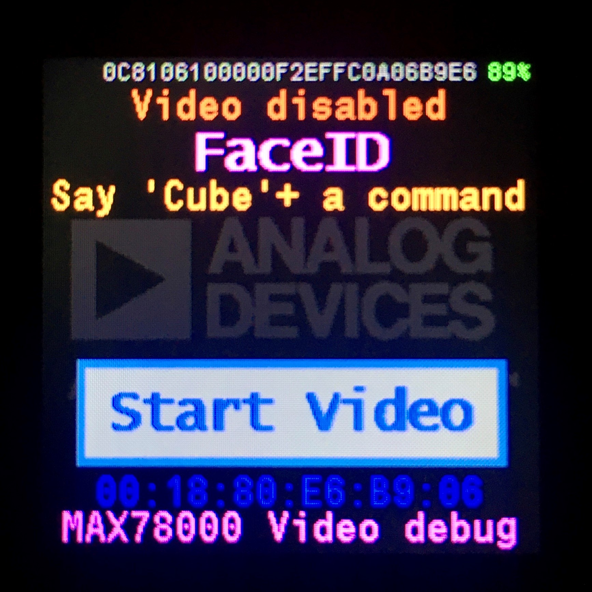 |  

### Load MAX78000 Video Firmware

- **WARNING:** If you are programming a board that already has MAX78000 Video firmware, make sure video is enabled and running. MAX78000 Video firmware goes to sleep mode when disabled, which causes interruptions during programming.

- MAX32666 firmware should be loaded before this step.

- Power cycle the MAXREFDES178#.

- Insert the MAXDAP-TYPE-C Pico adaptor board into MAXREFDES178# second debug channel. The MAXDAP-TYPE-C Pico adaptor and MAXREFDES178# LCD should face the same direction:
  
  

  **WARNING: Connecting Pico adaptor with wrong direction may cause the MAX78000 to become unresponsive and may require to open the camera and use the procedure described later to recover.**
  
- **Select MAX78000 Video target with button ‘Y’**. MAX78000 Video will disable sleep mode for 30 seconds to prevent interruptions during programming. Be quick after selecting target with button ‘Y’.

  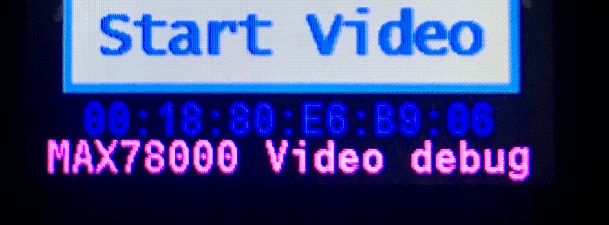

- Program MAX78000 Video firmware using provided script: 
  
  ```bash
  $ run.sh
  ```
  
  NOTE: The script will start openocd with following commands to update the firmware:
  
  - ```bash
    openocd -s ${TOOLCHAIN_PATH}/OpenOCD/scripts -f interface/cmsis-dap.cfg -f target/max78000_nsrst.cfg -c "program maxrefdes178_max78000_video/build/maxrefdes178_max78000_video.bin verify reset exit 0x10000000"
    ```
  
- Successful MAX78000 Video firmware update output:
  
  


NOTE: *If the firmware update fails or OpenOCD crashes repeatedly and you were unable to program the video or audio firmware, please erase the video or audio firmware using the MAX32625PICO Debugger as described in the “**Recovering/Erasing Video or Audio Firmware Using MAX32625PICO**” section*.

### Load MAX78000 Audio Firmware

- MAX32666 firmware should be loaded before this step.

- Power cycle the MAXREFDES178#.

- Insert the MAXDAP-TYPE-C Pico adaptor board into the MAXREFDES178# second debug channel. The MAXDAP-TYPE-C Pico adaptor and MAXREFDES178# LCD should face the same direction:
  
  

  **WARNING: Connecting Pico adaptor with wrong direction may cause the MAX78000 to become unresponsive and may require to open the camera and use the procedure described later to recover.**
  
- **Select the MAX78000 Audio target with button ‘Y’**. MAX78000 Audio will disable sleep mode for 30 seconds to prevent interruptions during programming. Be quick after selecting target with button ‘Y’.

  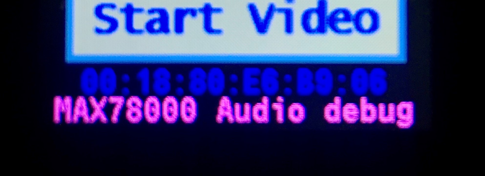

- Program MAX78000 Audio firmware using provided script: 
  ```bash
  $ run.sh
  ```
  
  NOTE: The script will start openocd with following commands to update the firmware:
  
  - ```bash
    openocd -s ${TOOLCHAIN_PATH}/OpenOCD/scripts -f interface/cmsis-dap.cfg -f target/max78000_nsrst.cfg -c "program maxrefdes178_max78000_audio/build/maxrefdes178_max78000_audio.bin verify reset exit 0x10000000"
    ```
  
- Successful MAX78000 Audio firmware update output:

  


  NOTE: *If the firmware update fails or OpenOCD crashes repeatedly and you were unable to program the video or audio firmware, please erase the video or audio firmware using MAX32625PICO Debugger as described in the “**Recovering/Erasing Video or Audio Firmware Using MAX32625PICO**” section*.

## Load Demo Firmware using App-Switcher and SD Card

MAXREFDES178# has special application switcher bootloader. App-Switcher can load MAX32666, MAX78000 Video and MAX78000 Audio demo firmware using a micro SD card.

**Warning:** The MAXREFDES178# App-Switcher is available from version v1.1.67 and later. Please update MAX32666, MAX78000 Video and MAX78000 Audio firmware with FaceID demo with version v1.1.67 (or later) by following steps on “**Load Demo Firmware using MINGW on Windows**” section. 

**NOTE: App-Switcher is embedded in the demo firmware. You don't need to load App-Switcher binaries separately.**

App-Switcher uses msbl file to load MAX32666, MAX78000 Video and MAX78000 Audio firmware from SD card. msbl files can be found in `build` directory when build is completed. Alternatively, you can download the latest .msbl files from GitHub Release or GitHub Actions.

### Prepare SD Card

- Format SD card with FAT32 file system. **Make sure to back up your SD Card content before formatting!**
- Download latest maxrefdes178_firmware.zip release from:
  - https://github.com/MaximIntegratedAI/refdes/releases for stable releases.
  - https://github.com/MaximIntegratedAI/refdes/actions/workflows/maxrefdes178.yml for GitHub Action builds.
- Extract zip content to SD card top directory.

  

App-Switcher SD Card folder structure requirements:

- All demo directories must be in the root directory of the SD card.
- All demo directories must contain `maxrefdes178_max32666_demo.msbl`, `maxrefdes178_max78000_video_demo.msbl`, and `maxrefdes178_max78000_audio_demo.msbl` files.

### Enter into App-Switcher

- Turn off the device by pressing power button.
- Insert micro SD card.
- While pressing button X, press power button to turn on the device.
- Device will start in App-Switcher mode.
- If there isn't any valid demo on MAX32666 flash, App-Switcher will start automatically.


### Load a Demo from SD Card

- Button X changes selected demo.

  - Selected demo is highlighted in Green.

- Button Y starts firmware update for selected demo.

  

  


- First, App-Switcher loads MAX78000 Audio firmware.

  


- Then, App-Switcher loads MAX78000 Video firmware.

  


- And last, App-Switcher loads MAX32666 firmware.

  


- If all three firmware update are successful. Device will restart with selected demo.

  


- If SD card is not inserted, App-Switcher halts and waits for a restart. Press power button for 12 seconds to turn off the App-Switcher.

  


- If demo folder content is invalid (incorrect or missing msbl files), App-Switcher returns to main menu.

  


## Debug Demo Firmware using MINGW on Windows

- Applications are loaded, debugged, and run using OpenOCD and GDB. This section shows how to do this specifically with MSYS on Windows.
- First, connect to the target with OpenOCD, then you can debug the target with GDB.
- Open MinGW console and cd into one of the demo directory:
  
  

### Connect to MAX32666 with OpenOCD

- Insert the MAXDAP-TYPE-C Pico adaptor board into MAXREFDES178# MAX32666 (first debug channel). The MAXDAP-TYPE-C Pico adaptor and MAXREFDES178# LCD should face opposite directions:
  
  
  
- Start OpenOCD for MAX32666:

  ```bash
  openocd -s ${TOOLCHAIN_PATH}/OpenOCD/scripts -f interface/cmsis-dap.cfg -f target/max32665_nsrst.cfg
  ```

- When the connection is successful, you will see messages as shown below:
  
  

### Connect to MAX78000s with OpenOCD

- Insert the MAXDAP-TYPE-C Pico adaptor board into MAXREFDES178# second debug channel. The MAXDAP-TYPE-C Pico adaptor and MAXREFDES178# LCD should face the same direction:
  
  

- Select MAX78000 Audio or MAX78000 Video target with button ‘Y’.

- Start OpenOCD for MAX78000:

  ```bash
  openocd -s ${TOOLCHAIN_PATH}/OpenOCD/scripts -f interface/cmsis-dap.cfg -f target/max78000_nsrst.cfg
  ```

- When the connection is successful, you will see messages as shown below:
  
  

### Debug Target with GDB

- Open another MinGW console and cd into a demo directory.

- Launch GDB using one of the following commands:

  ```bash
  arm-none-eabi-gdb maxrefdes178_max32666/build/maxrefdes178_max32666.elf
  arm-none-eabi-gdb maxrefdes178_max78000_video/build/maxrefdes178_max78000_video.elf
  arm-none-eabi-gdb maxrefdes178_max78000_audio/build/maxrefdes178_max78000_audio.elf
  ```
  
  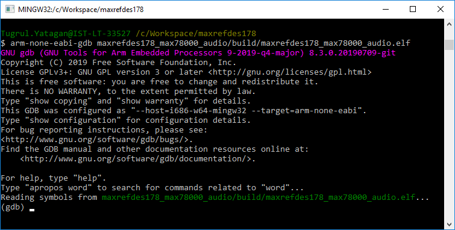

- Connect GDB to OpenOCD and reset the target:

  ```bash
  target remote localhost:3333
  monitor reset halt
  ```

- Load and verify the application:

  ```bash
  load
  compare-sections
  ```

- Reset the device and run the application:

  ```bash
  monitor reset halt
  c
  ```

## Debugging Applications with GDB

Follow the same steps provided in the *Loading and Running Applications on the EV Kit* section. While the application is running, use \<CTRL-C\> to interrupt the application and halt its execution. The table below lists a few of the commands available to you any time the application is halted:

| **Command**                    | **Short Command** | **Description**                                              |
| ------------------------------ | ----------------- | ------------------------------------------------------------ |
| monitor halt                   |                   | Halt the microcontroller.                                    |
| monitor reset halt             |                   | Reset the microcontroller and halt immediately.              |
| monitor max32xxx mass\_erase 0 |                   | Mass erase the flash.                                        |
| continue                       | c                 | Continue execution.                                          |
| break \<arg\>                  | b \<arg\>         | Set a breakpoint. Argument can be function\_name, file:line\_number, or \*address. |
| print \<variable\>             | p                 | Print the value of a variable. Variable must be in current scope. |
| backtrace                      | bt                | Print contents of the stack frame.                           |
| step                           | s                 | Execute the next instruction.                                |
| next                           | n                 | Execute the next line of code.                               |
| finish                         | f                 | Continue to the end of the current function.                 |
| info reg                       |                   | Print the values of the ARM registers.                       |
| help                           |                   | Print descriptions for available commands                    |
| help \<cmd\>                   |                   | Print description for given command.                         |


## Recovering/Erasing Video or Audio Firmware Using MAX32625PICO

If the programming of Audio or Video Firmware fails repeatedly (due to incomplete firmware update, application entering low power or shutdown mode too soon, etc.), you can use the following instructions to erase the existing audio or video firmware and recover. To proceed, a MAX32625PICO loaded with the latest DAPLINK Firmware and enabled automation is required. 

### Update MAX32625PICO DAPLINK Firmware

1. Press and hold the SW on MAX32625PICO and then connect it to the USB port to enter the maintenance mode. A MAINTENANCE drive should appear.

2. Drag and drop the latest bin firmware to the MAINTENANCES drive. The latest DAPLINK binary can be found here:
   https://github.com/MaximIntegratedMicros/max32625pico-firmware-images/blob/main/bin/max32625_max78000fthr_if_crc_v1.0.2.bin

3. Following the Drag-and-Drop, the debug adapter should reboot and reconnect as a drive named DAPLINK.

### Enable Automation in MAX32625PICO

1. Open the DETAILS.TXT file on the DAPLINK drive and make sure the ‘Automation allowed’ field is set to 1. If not, proceed to the next step.

2. To set the ‘Automation allowed’ field to 1, create an empty text file called “auto_on.cfg”. Connect MAX32625PICO to USB, wait for the DAPLINK drive to appear. Press and hold the SWD and drag and drop the “auto_on.cfg” to the DAPLINK drive. Then release the SW button when the drive unmounts. 

3. After it remounts, confirm ‘Automation allowed’ in details.txt is set to 1.

### Erase Video/Audio Firmware of Cube Camera

1. Turn off the cube camera and disconnect MAXDAP-TYPE-C Pico if connected.

2. Carefully open the camera from the top side (Maxim logo) while making sure that the flex cable connecting the two boards is not damaged or disconnected:

   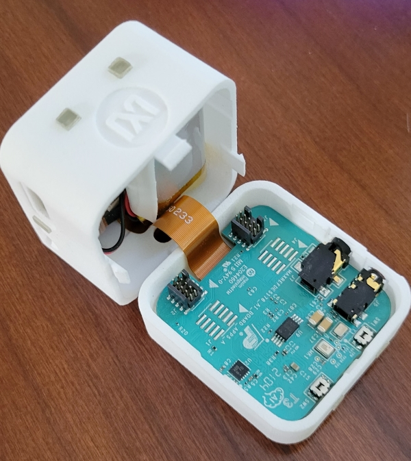


3. Remove the battery, connect the MAX32625PICO DAPLINK ribbon cable to J2 (for video firmware) or J3 (for audio firmware). Connect the MAX32625PICO to the USB port. A DAPLINK drive should appear.

   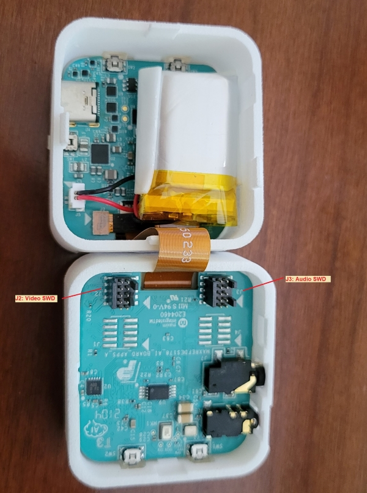

4. Create an empty file named “erase.act”.

5. Have a USB-C cable to Power up the Cube Camera using a power bank to USB power handy. But do NOT power up yet.

6. Drag and drop the empty “erase.act” file to the DAPLINK drive. A copying box opens and the progress stays at 0%.

7. Power up the Cube Camera using the USB-C cable. The copying progress quickly goes to 100% and the DAPLINK drive remounts. The flash of the target device is now erased.

8. Disconnect the DAPLINK ribbon cable from J2 or J3, reconnect the battery and close the camera case.


## Porting Applications to the Cube Camera

To add new MAXREFDES178# demo to this repository:

1. Copy one of the existing demo directories (i.e. maxrefdes178-CatsDogs) and rename as `maxrefdes178-NewDemoName`. Make your changes on new `maxrefdes178-NewDemoName` directory.

3. Add new demo name definition to `maxrefdes178_common\maxrefdes178_definitions.h`. Maximum demo name length is 15.

   ```
   // Common Demo Name
   #define DEMO_STRING_SIZE                   15
   #define FACEID_DEMO_NAME                   "FaceID"
   #define UNET_DEMO_NAME                     "UNet"
   #define WILDLIFE_DEMO_NAME                 "WildLife"
   #define CATSDOGS_DEMO_NAME                 "CatsDogs"
   ```

4. Set demo name in `max32666_main.c`, `max78000_audio_main.c` and `max78000_video_main.c`.
   ```
   snprintf(device_info.max32666_demo_name, sizeof(device_info.max32666_demo_name) - 1, "%s", CATSDOGS_DEMO_NAME);
   ...
   static char demo_name[] = CATSDOGS_DEMO_NAME;
   ```

5. Edit `maxrefdes178-NewDemoName\README.md` file for documentation.
   - Modify new demo guide.
   - Add link to the new demo documentation from this page in "Other available MAXREFDES178# demo pages" section.

6. Edit `.github\workflows\maxrefdes178.yml` file for GitHub Actions build.
   - Add new demo MAX32666, MAX78000 Video and MAX78000 Audio GitHub Actions build steps. Copy/Paste from existing demo build steps and modify.
   - Add new demo release directory to "Prepare Release" step.

Demo examples running on the Cube Camera include three main components:

1. First MAX78000 for video AI application: The application is executed on the first MAX78000 which is connected to the image sensor. This application initializes the image sensor, captures its image data, and streams it to the MAX32666 using the QSPI for display on the TFT. Additionally, it initializes the CNN and feeds the image sensor data to the CNN to run inferences. Inference results are unloaded and sent to the MAX32666 to be displayed. Preprocessing of image data and optional post-processing of the inference results are performed in this application.

2. Second MAX78000 for audio AI application: This application is developed on the second MAX78000 which is connected to the digital microphone. This application initializes the CNN and I2S digital microphone (or CODEC), collects audio samples, loads the CNN, runs inferences, unloads the results, and sends them to the MAX32666 to be displayed and/or further processed. Preprocessing of audio data and optional post-processing of the inference results are performed in this application.

3. MAX32666 for main control, connectivity, interface, and management. This application includes all initialization and control of Power Management, TFT, accelerometer, BLE, and other peripherals. 

   

To have an application running on the Cube Camera, generally all three components are needed. The provided examples include a framework with required control code, commands, and state machines for each of the three microcontrollers. 

For the fastest route to a working implementation, modify one of the provided demo examples as described below.

### MAX32666 Application (maxrefdes178_max32666): 

The simplified top-level diagram of the application is shown below:


The following modifications may be needed for a new example application:

#### `max32666_main.c`

1. Make sure the build version of audio, video and the MAX32666 is identical.

2. In `main()` function of `max32666_main.c`:

   - If needed, disable any unnecessary initialization (e.g. BLE, powmon).
   - If only a video (or only an audio) application exists, remove QSPI communication to the non-existent components. A typical QSPI communication with the audio/video core is:

   ```c++
   for (int try = 0; try < 3; try++) {
       qspi_master_send_video(NULL, 0, QSPI_PACKET_TYPE_VIDEO_VERSION_CMD);
       qspi_master_wait_video_int();
       qspi_master_video_rx_worker(&qspi_packet_type_rx);
       if (device_info.device_version.max78000_video.major || device_info.device_version.max78000_video.minor) {
           break;
       }
   ```

3. In the `run_application()` function of `max32666_main.c`:

   - If needed, remove QSPI TX and RX to/from non-existent audio or video components, BLE, activity sensor, power accumulator, etc.
   - Update the state machine to process the classification result, e.g. `device_status.classification_video.classification` or `device_status.classification_audio.classification`
   - Modify button and TFT touch functionality, LED and display information on TFT as needed.

#### `maxrefdes178_definitions.h`

1. Add/modify `qspi_packet_type_e` commands as required. The QSPI commands define the communication between MAX32666 and audio/video MAX78000.
2. Update LCD and camera width/height and format, if the image capture and display format are different.

### MAX78000 Audio/Video Applications (maxrefdes178_max78000_audio, maxrefdes178_max78000_video): 

The top-level diagram of the audio/video application is shown below:

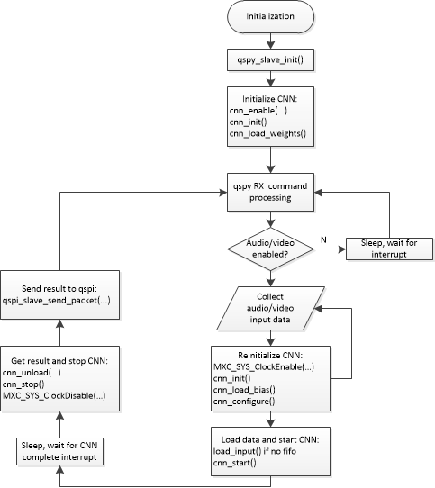


The following steps summarize the modifications needed to port a new example: 

1. Update `cnn.c`, `cnn.h` and `weights.h` in the `src` and `include` folders. These auto-generated files are created by the synthesis tool once the network is trained, quantized and synthesized.

2. Add your application to `max78000_audio_main.c` and `max78000_video_main.c`. Include necessary initialization, preprocessing of peripherals, microphone or image sensor.

3. Update the QSPI command processing state-machine in the main loop as necessary to communicate with MAX32666.

4. Update the CNN code block to load weights, bias, configuration, data, start inference, and unload the result in the synthesized auto-generated code of your application. 

   The following code snippet demonstrates the CNN block:

   ```c
   // Enable CNN clock
   MXC_SYS_ClockEnable(MXC_SYS_PERIPH_CLOCK_CNN);
   
   cnn_init(); // Bring state machine into consistent state
   
   //cnn_load_weights(); // Only needed first time, weights will be retained in SLEEP, UPM, BACKUP or STANDBY modes
   
   cnn_load_bias(); //load bias
   
   cnn_configure(); // Configure state machine
   
   // Custom function to load data to CNN memory 
   load_input(); // Load data to CNN after any required preprocessing. For FIFO cases, move this after cnn_start()
   
   cnn_start(); // start CNN
   
   // Wait for CNN to complete
   while (cnn_time == 0) {
       __WFI();
   }
   
   // read result, the last layer of NN model should be wide=TRUE for CNN to generate 32-bit outputs. Otherwise, will be 8-bit
   cnn_unload((uint32_t *)ml_data);
   
   cnn_stop();
   
   // Disable CNN clock to save power
   MXC_SYS_ClockDisable(MXC_SYS_PERIPH_CLOCK_CNN);
   
   // run softmax
   softmax_q17p14_q15((const q31_t*) ml_data, NUM_OUTPUTS, ml_softmax);
   ```

   - **Note: If the FIFO option is used to synthesize your example (`--fifo`, or `--fast-fifo` in ai8xize.py),** **`cnn_start()` should be called first, followed by loading the data to the FIFOs as they become available. The CNN will start automatically when enough data is available.**

5. Populate the classification result in the `classification_result_t` structure to be reported to MAX32666:

   ```c++
   typedef enum {
       CLASSIFICATION_NOTHING = 0,
       CLASSIFICATION_UNKNOWN,
       CLASSIFICATION_LOW_CONFIDENCE,
       CLASSIFICATION_DETECTED,
   
       CLASSIFICATION_LAST
   } classification_e;
   
   // Classification command response
   typedef struct __attribute__((packed)) {
       float probabily;  // confidence level
       classification_e classification;  // status of detection
       char result[CLASSIFICATION_STRING_SIZE]; // result of classification
   } classification_result_t;
   ```

6. Populate the statistics in the `max78000_statistics_t` structure to be reported to MAX32666:

   ```c
   // MAX78000 statistics field
   typedef struct __attribute__((packed)) {
       uint32_t cnn_duration_us;
       uint32_t capture_duration_us;
       uint32_t communication_duration_us;
       uint32_t total_duration_us;
   } max78000_statistics_t;
   ```

7. Report the classification result and statistics back to MAX32666 using the appropriate QSPI commands. For example, for audio results:

   ```c
   // report classification result
   qspi_slave_send_packet((uint8_t *) &classification_result, sizeof(classification_result),
                           QSPI_PACKET_TYPE_AUDIO_CLASSIFICATION_RES);
   // report statistics
   qspi_slave_send_packet((uint8_t *) &max78000_statistics, sizeof(max78000_statistics),
                           QSPI_PACKET_TYPE_AUDIO_STATISTICS_RES);
   ```

8. Send the raw image as needed (video only) to MAX32666: `send_img()`

