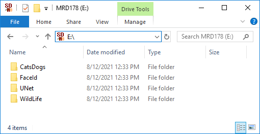
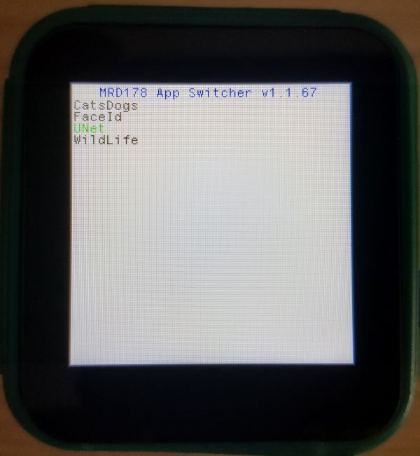
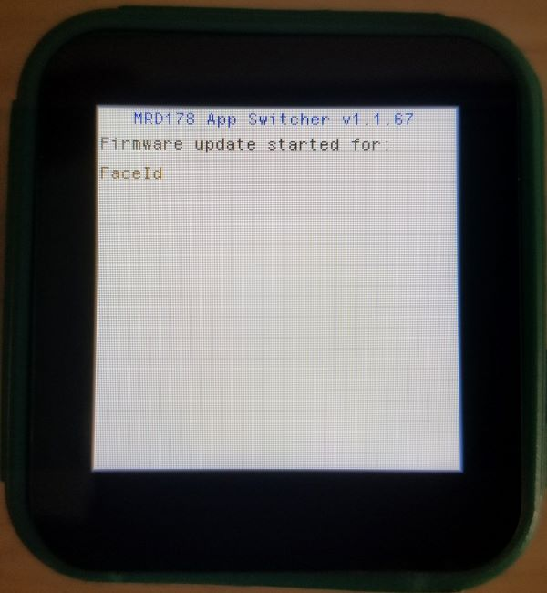
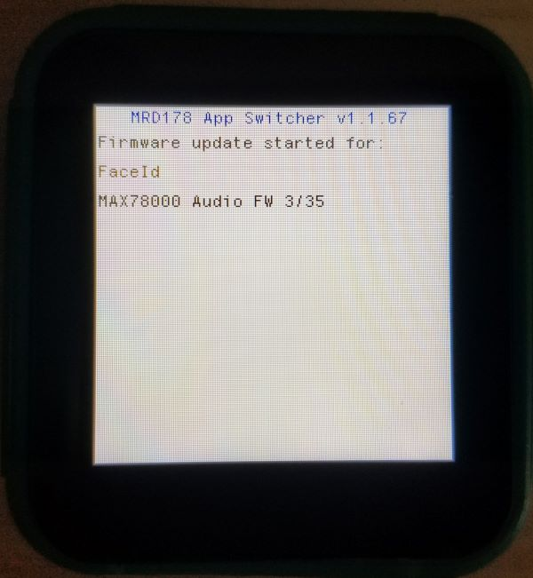
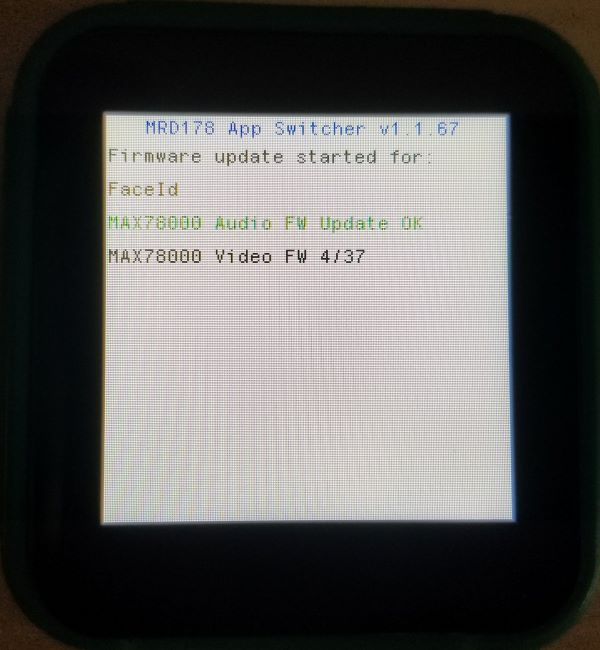
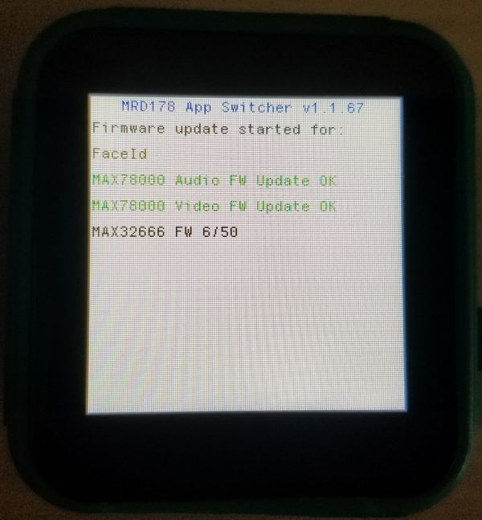
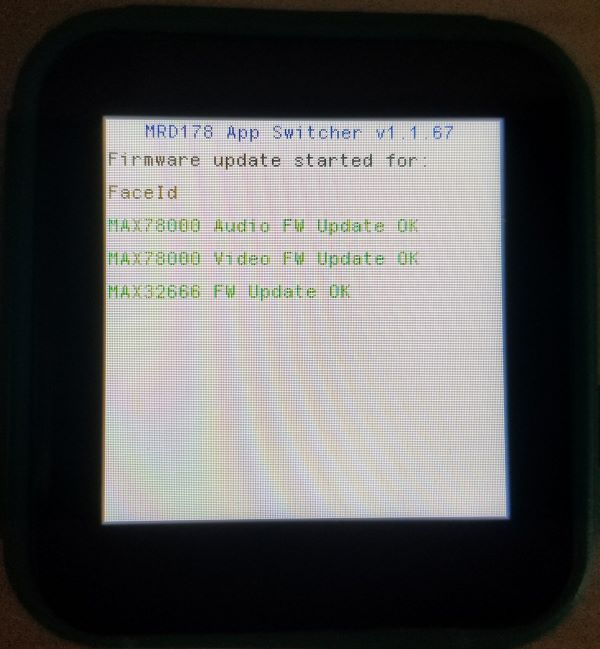
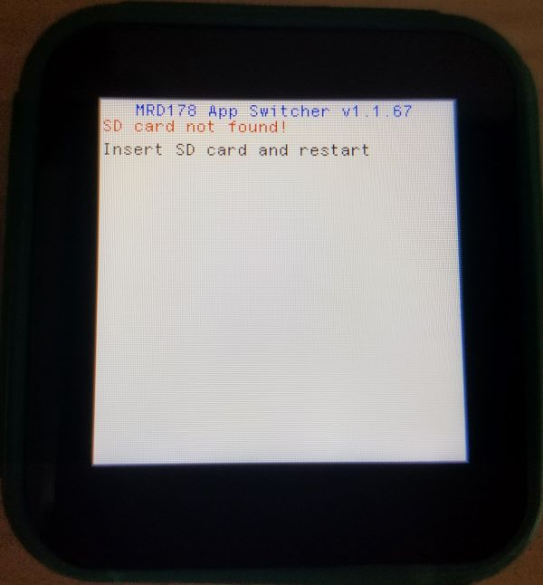

# App Switcher

 

MAXREFDES178# has special application switcher bootloader. App-Switcher can load MAX32666, MAX78000 Video and MAX78000 Audio demo firmware using a micro SD card.

**Warning:** The MAXREFDES178# App-Switcher is available from version **v1.1.67** and later. Please update MAX32666, MAX78000 Video and MAX78000 Audio firmware with FaceID demo with version **v1.1.67** (or later) by following steps on “Load Demo Firmware using MINGW on Windows” section.

**NOTE:** App-Switcher is embedded in the demo firmware. You **don't** need to load App-Switcher binaries separately.

App-Switcher uses **msbl** file to load MAX32666, MAX78000 Video and MAX78000 Audio firmware from SD card. **msbl** files can be found in `build` directory when build is completed. Alternatively, you can download the latest **.msbl** files from GitHub Release or GitHub Actions.

  

## Preparing an SD Card

  

* Format SD card with **FAT32** file system. **Make sure to back up your SD Card content before formatting!**

* Download latest maxrefdes178_firmware.zip release from:

  * https://github.com/MaximIntegratedAI/refdes/releases for stable releases.
  * https://github.com/MaximIntegratedAI/refdes/actions/workflows/maxrefdes178.yml for GitHub Action builds.

* Extract zip content to SD card top directory.

App-Switcher SD Card folder structure requirements:

  * All demo directories must be in the root directory of the SD card.
  * All demo directories must contain `maxrefdes178_max32666_demo.msbl`, `maxrefdes178_max78000_video_demo.msbl`, and `maxrefdes178_max78000_audio_demo.msbl` files.

  

## Running App-Switcher

* Turn off the device by pressing **power button**.
* Insert micro SD card.
* While pressing **Button X**, press **power button** to turn on the device.
* Device will start in App-Switcher mode.
* If there isn't any valid demo on MAX32666 flash, App-Switcher will start automatically.

  

## Loading a Demo From SD Card

  

* Pressing **Button X** changes the selected demo.
  * Selected demo is highlighted in Green.

  

* **Button Y** starts firmware update for the selected demo.

 

  

 

* First, App-Switcher loads MAX78000 Audio firmware.

 

  

 

* Then, App-Switcher loads MAX78000 Video firmware.

 

  

 

* And last, App-Switcher loads MAX32666 firmware.

 

  

 

* If all three firmware update are successful. Device will restart with selected demo.

 

  

 

* If SD card is not inserted, App-Switcher halts and waits for a restart. Press power button for 12 seconds to turn off the App-Switcher.

 

  

 

* If demo folder content is invalid (incorrect or missing msbl files), App-Switcher returns to main menu.

 

  

 

   

   

NEXT : <a href="RecoveryProcedure.md">Recovery Procedure</a>

