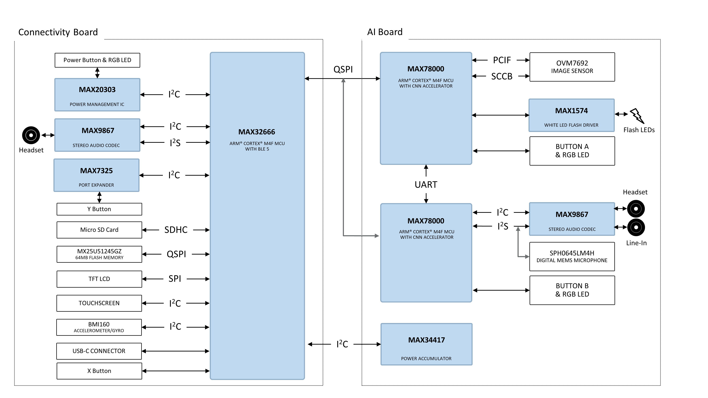
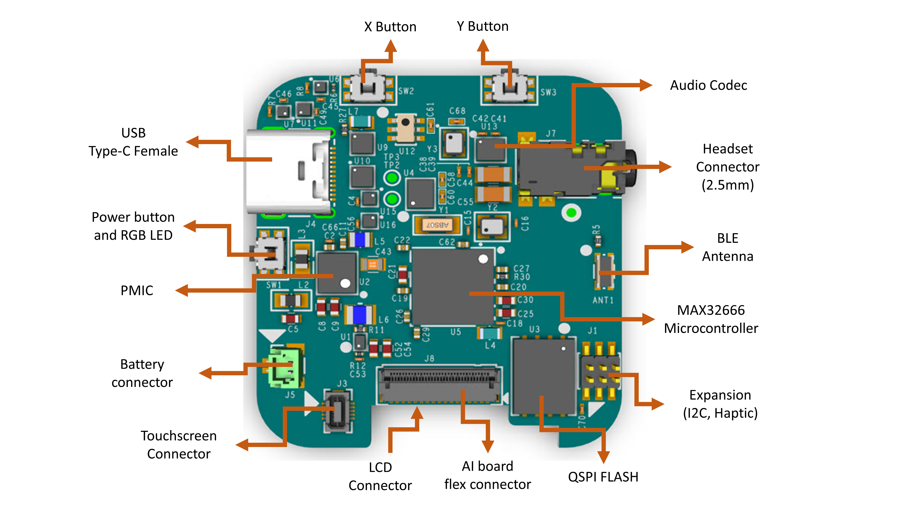
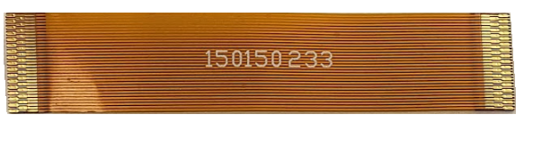

# Block Diagram

  

    
  

The MAXREFDES178 reference design hardware consists of two boards:

* Connectivity Board :  
This is the board placed at the rear part of the enclosure, next to the TFT LCD. Connectivity board is based on [MAX32666](https://www.analog.com/en/products/max32666.html) Dual-Core Arm® Cortex-M4 Microcontroller with Bluetooth 5. Main functions of this board is provide interfaces and power to the platform.
USB communication, debugging/programming, LCD, touchscreen interfaces, SD Card slot and IMU sensor are placed on this board. 
 

* AI Board :  
The AI board has the same form factor and size with the connectivity board.  It is attached to the front part of the enclosure. This board hosts two MAX78000 processors. Both MAX78000 processors are exactly the same parts. For the sake of clarity of the schematic diagrams and documentation, MAX78000 processors are named as MAX7000 Image and MAX78000 Audio.

  * MAX78000 Image (U4) :
  This processor is mainly responsible from AI vision applications. The image sensor of the MAXREFDES178 reference design is connected to this processor via PCIF interface. For camera control and configuration there is also a SCCB interface between the image sensor and the processor. The processor configures the image sensor with desired resolution and captures images using the PCIF interface.

  [MAX1574](https://www.analog.com/en/products/max1574.html) White LED Charge Pump IC is controlled with the MAX78000 Image processor. There are two white LEDs around the image sensor LEDs.

  * MAX78000 Audio (U6) :
  For audio applications such as keyword detection, speaker identification, this MAX78000 processor can be used since it is connected to an on-board MEMS microphone via I2S interface as well as [MAX9867](https://www.analog.com/en/products/max9867.html) Ultra-Low Power Stereo Audio Codec.

Connectivity Board and AI Board are connected to each other via a 0.30mm pitch, 33 circuits flex cable. The part number for the cable is Molex 150150233.

Alternatively if it is needed to place front and rear part of the enclosure apart, a longer version of this cable can be used. 

The flex cable carries power to the AI board from the Connectivity Board. Besides power there are multiple interfaces such as QSPI, I2C and GPIO signals are available.

The existing MAXREFDES178 example projects are based on QSPI interface between [MAX32666](https://www.analog.com/en/products/max32666.html) and [MAX78000](https://www.analog.com/en/products/max78000.html) Image / [MAX78000](https://www.analog.com/en/products/max78000.html) Audio processors on the platform. [MAX32666](https://www.analog.com/en/products/max32666.html) is configured as QSPI master and  [MAX78000](https://www.analog.com/en/products/max78000.html) processors are configured as QSPI slave devices.

   

NEXT : <a href="PowerTree">Power Tree</a>

