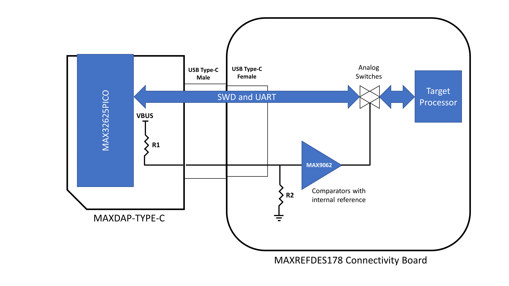
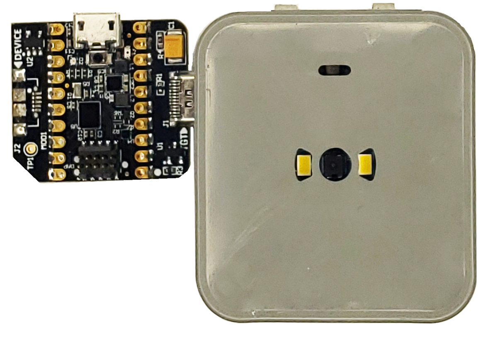
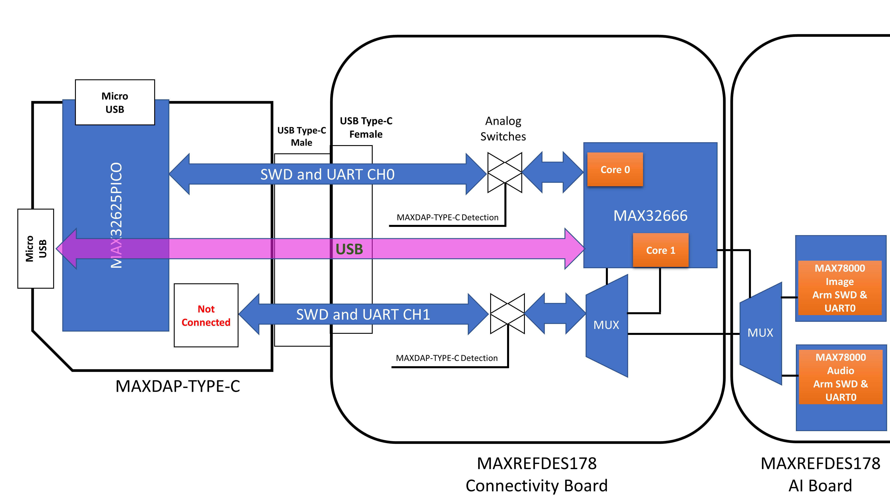
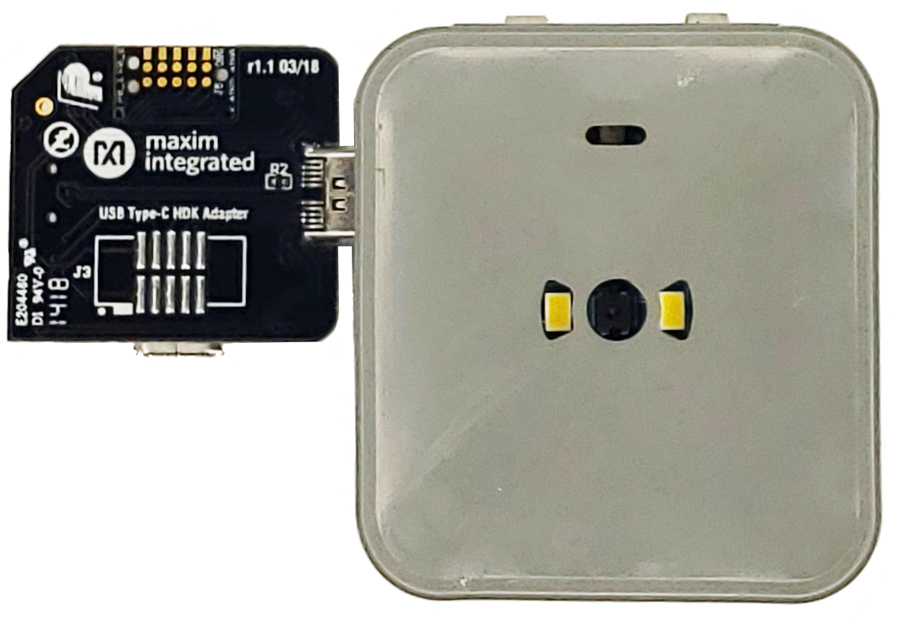

# Debugger Operation

MAXREFDES178 Reference Design has 3 processors, each processor have dual cores. This makes it complex to fit debug access ports for such a small portable device. 

|Processor|Cores|Core Type|Debug Interface|USB Type C Connector Accessible|
| ------- |------|-----|----|----|
|MAX32666|Core0|Arm Cortex M4F|SWD|YES|
|        |Core1|Arm Cortex M4F|SWD|YES|
|MAX78000 Image|Main Core|ARM Cortex M4F|SWD|YES|
|        |Coprocessor|Risc-V|JTAG|NO|
|MAX78000 Audio|Main Core|ARM Cortex M4F|SWD|YES|
|        |Coprocessor|Risc-V|JTAG|NO|

To simplify and minimize space required for debug interfaces, MAXREFDES178 uses USB Type-C connector by repurposing the non data transfer related pins.
    

## MAXDAP-TYPE-C

MAXDAP-TYPE-C is a [DAPLink](https://daplink.io/) based debugger interface. The DAPLink firmware allows access to ARM SWD from a USB Host device.  The debugger is a carrier board with USB Type-C male connector and MAX32625PICO board soldered as a sub-board. MAX32625PICO is the debugger interface and the carrier board allows physical interface to target via USB Type-C connector. The 10-pin 1.27mm pitch SWD header connector on MAX32625PICO board is not used.

 

The schematics of MAXDAP-TYPE-C can be found here:
[MAXDAP-TYPE-C Schematics](docs/maxdap_type_c_schematic.pdf)
 

|Connector|Connected To|Purpose|
| ------- |------|-----|
|USB Type-C Male|Target Device|SWD (Serial Wire Debug) signals and optional UART|
|Debugger Connector|Host (PC)|DAPLink interface. Allow debugging of selected target|
|Target USB Interface|Host (PC)|USB pass-through connector. Normally a standard USB Type-C cable is used to connect the target to a Host PC. When MAXDAP-TYPE-C is plugged for debugging or programming, target's USB interface becomes occupied. It is possible to use this connector to access target USB interface.|

The female USB Type-C connector on MAXREFDES178 is located on Connectivity board. USB data lines are connected to [MAX32666](https://www.analog.com/en/products/max32666.html) microcontroller on the same board.

MAXDAP-TYPE-C can:
* Provide power to MAXREFDES178 reference design using USB Type-C connector.
* Debug or program selected target processor. Please refer to [Target Selection](#Target-Selection) section in this document.
MAXREFDES178 Connectivity Board
* Provide access to selected target processor UART (console).  Please refer to [Target Selection](#Target-Selection) section in this document.
* Provide access to target USB interface. [MAX32666](https://www.analog.com/en/products/max32666.html) USB interface can be accessed using the second Micro USB connector.

MAXREFDES178 has been designed to work with a standard USB Type-C cable for powering, charging or communication via [MAX32666](https://www.analog.com/en/products/max32666.html) USB interface. A standard USB Type-C cable may be inserted into the MAXREFDES178 in either orientation.

USB-C Standard Alternate Modes (Thunderbolt, DisplayPort, HDMI, MHL etc) and USB Power Delivery features are not available and not used on MAXREFDES178. USB Type-C connector is merely used for having more electrical connections to the platform. These additional electrical connections are used for SWD and UART (console) interfaces.

  

## MAXDAP-TYPE-C Detection

MAXREFDES178 can detect if a standard USB Type-C connector or MAXDAP-TYPE-C is plugged in. The SWD and UART interfaces of the target processor will be connected to the port only if MAXDAP-TYPE-C is plugged in. For all other cases, the debug and UART (console) connections will be isolated from the connector using analog switches.

Two simple resistor voltage dividers and comparators on A5 (CC1) and B5 (CC2) pins of the USB Type-C connector is used for detection. High-side of the resistor divider is placed on MAXDAP-TYPE-C board. The low-side is placed on MAXREFDES178 connectivity board. When two boards gets connected, the mid-point of the resistor divider is compared with the internal reference of the analog comparators on MAXREFDES178 connectivity board. If the voltage is above analog comparator's internal reference, multiple analog switches gets turned on and connect SWD (SWDIO, SWDCLK, VREF) and target UART (RXD, TXD) signals to the USB Type-C connector.
  
The simplified diagram of MAXDAP-TYPE-C board detection of MAXREFDE178 is shown below:

    

## USB Type-C Pinout
  
MAXREFDES178 Connectivity Board USB Type-C Female Connector Pinout:

|Pin#|MAXREFDES178 Name|Description| |Pin#|MAXREFDES178 Name|Description|
|----|-----------------|-----------|-|----|-----------------|-----------|
|A1|GND|Ground| |B12|GND|Ground|
|A2|HDK_SWDCLK0|SWD interface clock for straight alignment| |B11|HDK_RX1|UART RX for reversed alignment|
|A3|HDK_SWDIO0|SWD interface data for straight alignment| |B10|HDK_TX1|UART TX for reversed alignment|
|A4|USB_VBUS_C|USB Power Supply| |B9|---|Not Used|
|A5|RSENSE0     |MAXDAP-TYPE-C Detection| |B8|HDK_VREF|Target Voltage Detection for SWD|
|A6|DP0     |MAX32666 USB D+| |B7|DM0|MAX32666 USB D-|
|A7|DM0     |MAX32666 USB D-| |B6|DP0|MAX32666 USB D+|
|A8|HDK_VREF|Target Voltage Detection for SWD| |B5|RSENSE1|MAXDAP-TYPE-C Detection|
|A9|---|Not Used| |B4|USB_VBUS_C|USB Power Supply|
|A10|HDK_TX0|UART TX for straight alignment| |B3|HDK_SWDIO1|SWD interface data for reversed alignment|
|A11|HDK_RX0|UART RX for straight alignment| |B2|HDK_SWDCLK|SWD interface clock for reversed alignment|
|A12|GND|Ground| |B1|GND|Ground|

  
MAXDAP-TYPE-C USB Type-C Male Connector Pinout:

|Pin#|MAXDAP-TYPE-C|Description| |Pin#|MAXDAP-TYPE-C|Description|
|----|-----------------|-----------|-|----|-----------------|-----------|
|A1|GND|Ground| |B12|GND|Ground|
|A2|HDK_SWDCLK|SWD interface clock| |B11|---|Not used. Accessible via not-populated J3 connector|
|A3|HDK_SWDIO|SWD interface data| |B10|---|Not used. Accessible via not-populated J3 connector|
|A4|VBUS|USB Power Supply| |B9|---|Not Used|
|A5|RSENSE High-side|MAXDAP-TYPE-C Detection| |B8|---|Not used. Accessible via not-populated J3 connector|
|A6|DP0     |MAX32666 USB D+| | | | |
|A7|DM0     |MAX32666 USB D-| | | | |
|A8|TGT_VCC|Target Voltage Detection for SWD| |B5|RSENSE High-side|MAXDAP-TYPE-C Detection|
|A9|---|Not Used| |B4|USB_VBUS_C|USB Power Supply|
|A10|TGT_TX|UART TX| |B3|SWDIO_HDR|Not used. Accessible via not-populated J3 connector|
|A11|TGT_RX|UART RX| |B2|SWDCLK_HDR|Not used. Accessible via not-populated J3 connector|
|A12|GND|Ground| |B1|GND|Ground|

    

## Target Selection

 

MAXDAP-TYPE-C has one SWD interface and one UART (console) interface available on the USB Type-C male connector. On the other hand, MAXREFDES178 has two SWD interfaces and two UART )(console) interfaces available on the USB Type-C female connector. Depending on the alignment of MAXDAP-TYPE-C USB Type-C connector insertion alignment (straight or reversed), a target microcontroller selection can be done.
   

### Straight connection of MAXDAP-TYPE-C and MAXREFDES178:
 

  

  

When the components on MAXDAP-TYPE-C and MAXREFDES178front (camera) face are aligned as shown in the image, DAPLink and UART (console) gets connected to [MAX32666](https://www.analog.com/en/products/max32666.html) microcontroller. The secondary SWD and UART (console) interfaces of MAXREFDES178 isn't connected to MAX32625PICO board. At the bottom side of MAXDAP-TYPE-C, there is a footprint for unpopulated 10-pin 1.27mm pin debug header. This operation is not supported but it is possible to access secondary SWD and UART using this header pads. It is suggested to use dedicated SWD header connectors directly on MAXREFDES178 AI board instead by separating front and rear parts of the cube camera enclousure.

### Reversed connection of MAXDAP-TYPE-C and MAXREFDES178:

 

  

  

If the MAXDAP-TYPE-C and MAXREFDES178 connected to each other with USB Type-C connector in reverse alignment as shown in the image, the first SWD channel and UART (console) channel of MAXREFDES178 becomes separated from the debugger.
The second SWD and UART (console) channel gets connected to the debugger as shown in the diagram. In this case there are multiple target connection options. The target selection is done with a series of MAX14689 multiplexers. HDK1_TARGET_SEL, UART_TARGET_SEL, SLAVE_DEBUG_SEL signals on the connectivity board selects which SWD and UART interface gets connected to the second channel. All these selection signals are controlled by [MAX32666](https://www.analog.com/en/products/max32666.html) on the connectivity board.

MAXREFDES178 demo applications have target selection implemented using the Y button at the top side of the enclosure. Pressing Y button switches between:

* MAX32666 Core1
* MAX78000 Image (AKA MAX78000 Video)
* MAX78000 Audio

  

  

Stop switching when the desired target is displayed on LCD and use debugger to debug or program the target processor.

   

NEXT : <a href="ProgrammingFirmware.md">Programming Firmware</a>

