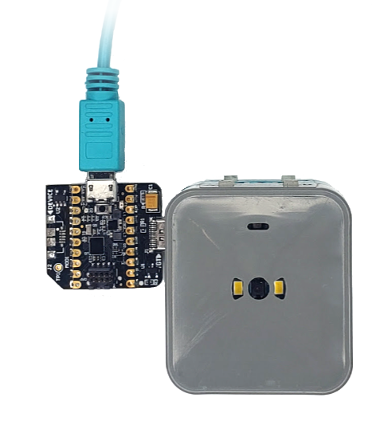
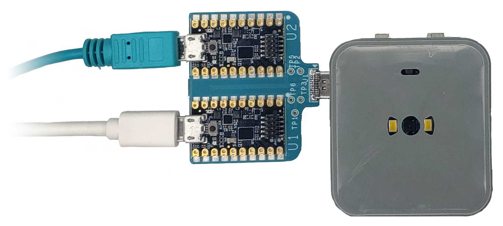
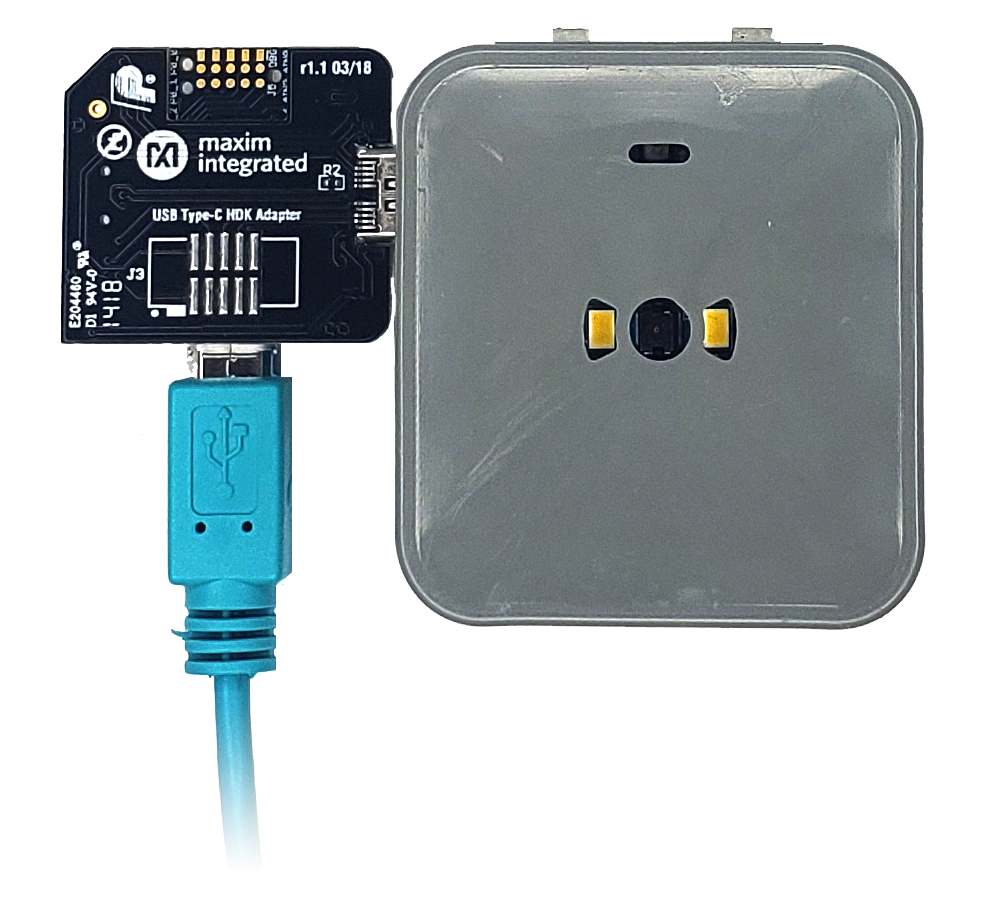
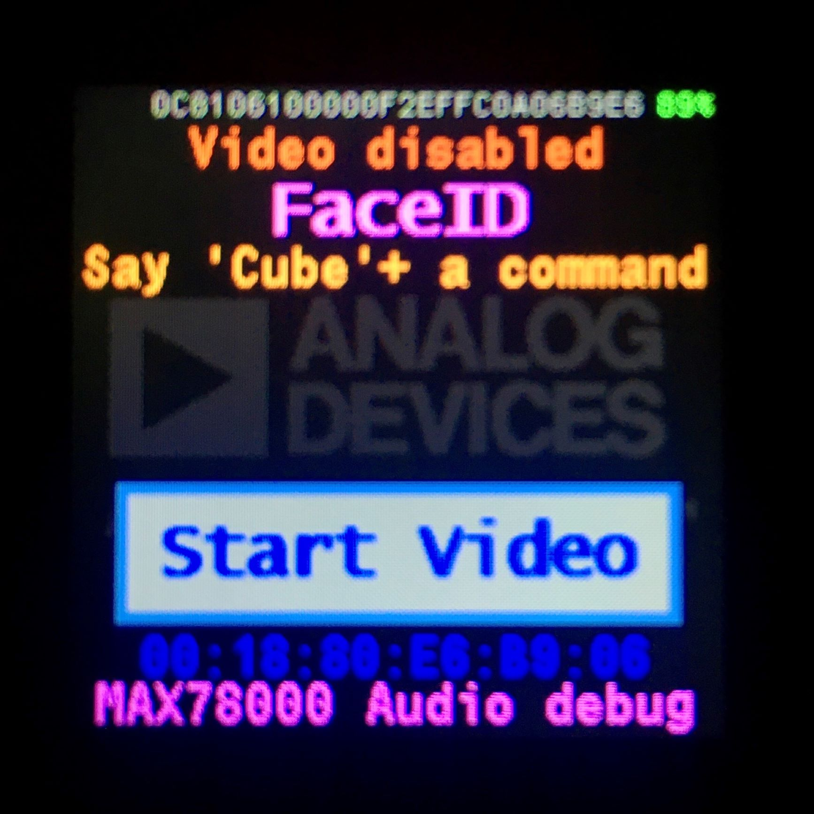
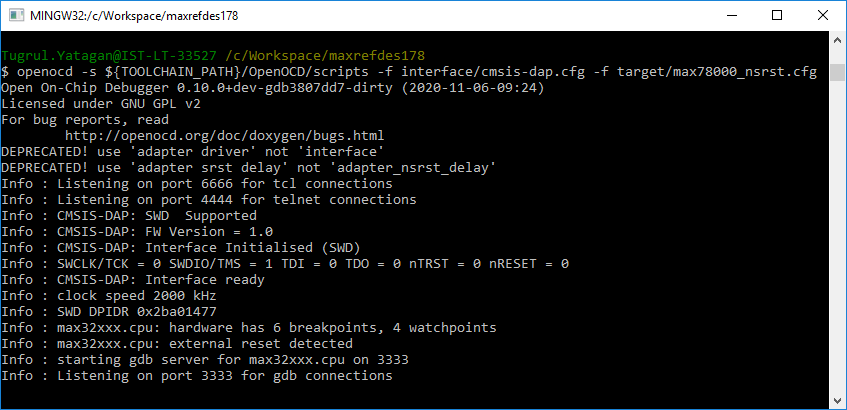

# Debugging Demo Firmware Using MINGW on Windows

<br>

pplications are loaded, debugged, and run using OpenOCD and GDB. This section shows how to do this specifically with MSYS on Windows. First, connect to the target with OpenOCD, then you can debug the target with GDB.

Open MinGW console and cd into one of the demo directory:

<p align="center"></p>

<br>

## Debugging MAX32666 Firmware

<br>

1 Connect the debugger/programmer to the MAXREFDES178 Cube Camera

* ### MAXDAP-TYPE-C
    Insert the MAXDAP-TYPE-C into MAXREFDES178 MAX32666 (first debug channel).
    The MAXDAP-TYPE-C and MAXREFDES178 cube camera lens should face **same** direction.

<br>


<p align="center"></p>

<br>

* ### MAXDAP-TYPE-C DUAL
    When MAXDAP-TYPE-C-DUAL is the debugger/programmer, insert to the MAXREFDES178 as shown in the picture. Both components of MAXDAP-TYPE-C-DUAL and MAXREFDES178 cube camera lens are facing **same** direction.
 
   Connect Micro-USB cable to U1 (first debug channel) of MAXDAP-TYPE-C-DUAL. In the picture it is shown that a **white** Micro-USB cable is plugged in. Do **not** plug an USB cable to U2 (second debug chnanel) of MAXDAP-TYPE-C-DUAL. (**Green cable** in the picture shouldn't be connected)


<br>

<p align="center"></p>

<br>

2 Start OpenOCD for MAX32666:
```
openocd -s ${TOOLCHAIN_PATH}/OpenOCD/scripts -f interface/cmsis-dap.cfg -f target/max32665_nsrst.cfg
```

3 When the connection is successful, you will see messages as shown below:

<br>

<p align="center"></p>

<br>

<br><br><br>

<br>

## Debugging MAX78000 Video or MAX78000 Audio Firmware

<br>

 1 Connect the debugger/programmer to the MAXREFDES178 Cube Camera

* ### MAXDAP-TYPE-C
    Insert the MAXDAP-TYPE-C into MAXREFDES178 second debug channel.
    The MAXDAP-TYPE-C and MAXREFDES178 cube camera lens should face **opposite** direction.

<br>


<p align="center"></p>

<br>

* ### MAXDAP-TYPE-C DUAL
    When MAXDAP-TYPE-C-DUAL is the debugger/programmer, insert to the MAXREFDES178 as shown in the picture. Both components of MAXDAP-TYPE-C-DUAL and MAXREFDES178 cube camera lens are facing **same** direction.
 
   Connect Micro-USB cable to U2 (second debug channel) of MAXDAP-TYPE-C-DUAL. In the picture it is shown that a **green** Micro-USB cable is plugged in. Do **not** plug an USB cable to U2 (first debug chnanel) of MAXDAP-TYPE-C-DUAL. (**White** cable in the picture shouldn't be connected)

<br>

<p align="center"></p>

<br>

2. Select **MAX78000 Video** or or **MAX78000 Audio** target with button ‘Y’.

<p align="center">


</p>


3. Start OpenOCD for MAX78000:

```
openocd -s ${TOOLCHAIN_PATH}/OpenOCD/scripts -f interface/cmsis-dap.cfg -f target/max78000_nsrst.cfg
```

<br>

<p align="center">

</p>

<br>


# Debug Target with GDB

<br>
1. Open another MinGW console and cd into a demo directory. Launch GDB using one of the following commands:

<br>

```
arm-none-eabi-gdb maxrefdes178_max32666/build/maxrefdes178_max32666.elf
arm-none-eabi-gdb maxrefdes178_max78000_video/build/maxrefdes178_max78000_video.elf
arm-none-eabi-gdb maxrefdes178_max78000_audio/build/maxrefdes178_max78000_audio.elf
```

<br>

<br>

<p align="center">

</p>

<br>

2. Connect GDB to OpenOCD and reset the target:
<br>

```
target remote localhost:3333
monitor reset halt
```

<br>

3. Load and verify the application:
<br>

```
load
compare-sections
```

<br>

4. Reset the device and run the application:
<br>

```
monitor reset halt
c
```

<br>


# Debugging Applications with GDB
<br>
Follow the same steps provided in the Loading and Running Applications on the EV Kit section. While the application is running, use <CTRL-C> to interrupt the application and halt its execution. The table below lists a few of the commands available to you any time the application is halted:

|Command	|Short Command	|Description|
|-|-|-|
|monitor halt		||Halt the microcontroller.
|monitor reset halt		||Reset the microcontroller and halt immediately.
|monitor max32xxx mass_erase 0		||Mass erase the flash.
|continue	|c	|Continue execution.
|break `<arg>`	|b `<arg>`	|Set a breakpoint. Argument can be function_name, file:line_number, |or *address.
|print `<variable>`	|p	|Print the value of a variable. Variable must be in current scope.
|backtrace	bt	||Print contents of the stack frame.
|step	|s	|Execute the next instruction.
|next	|n	|Execute the next line of code.
|finish	|f	|Continue to the end of the current function.
|info reg		||Print the values of the ARM registers.
|help		||Print descriptions for available commands
|help `<cmd>`		||Print description for given command.


<br><br><br>
<div class="nextpage" style="margin-left: 0; margin-right: auto; text-align: right; background-color: #dfd;" >
NEXT : <a href="AppSwitcher.md">App Switcher</a>
</div>
