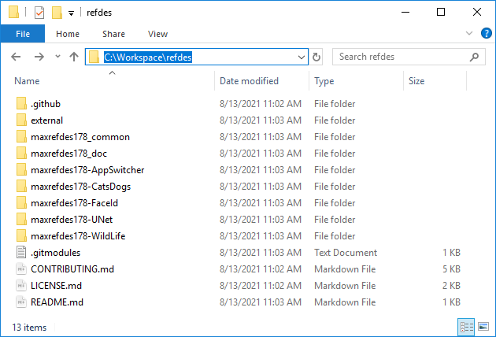
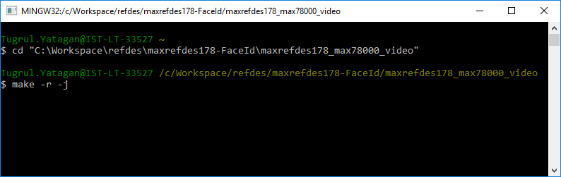

# Development Environment Setup

The MAXREFDES178 demo applications are developed using C language and they can be compiled using GNU Arm Embedded Toolchain. ADI provides a complete installation package for Windows, Ubuntu Linux ad macOS host operating systems. The package includes an SDK with GNU Arm Toolchain, ADI SDK libraries, example projects, OpenOCD debugger and Eclipse IDE. VSCode support files for existing VSCode installation are also available.

## ADI MSDK Download

ADI MSDK is available to download:

* [Windows](https://www.analog.com/en/design-center/evaluation-hardware-and-software/software/software-download?swpart=SFW0010820A)
* [Ubuntu Linux](https://www.analog.com/en/design-center/evaluation-hardware-and-software/software/software-download?swpart=SFW0018720A)
* [macOS](https://www.analog.com/en/design-center/evaluation-hardware-and-software/software/software-download?swpart=SFW0018610A)

The repository with the latest libraries and examples can be accessed via the ADI MSDK repository:

[Analog Devices MSDK Repository](https://github.com/Analog-Devices-MSDK/msdk)

After the installation of MSDK, on Windows, the MSYS shell (included in the MSDK) can be used to build examples. Start msys.bat to launch the shell. The shell can be accessed from the Windows Start Menu or in the default installation directory shown below:

## Downloading the MAXREFDES178 Demo Repo

Download MAXREFDES178# from GitHub with submodules:

```
 git clone --recurse-submodules git@github.com:MaximIntegratedAI/refdes.git
```

<p align="center"></p>


<div style="margin-left: 0; text-align: left; background-color: #dfd;" >

*WARNING: Put the **refdes** directory close to the root of the drive. Long Windows paths may cause failed builds.*

</div>

There are multiple demos for MAXREFDES178. Each demo codebase has its own directory. MAXREFDES178 common files are in the top directory.

Repo folder structure:

* `external:`<br>
External drivers, modules and binaries.<br>
* `maxrefdes178_common:`<br>
MAX32666, MAX78000 Video and MAX78000 Audio firmware common headers and source files.<br>
* `maxrefdes178_doc:`<br>
Markdown documentation files.<br>
* `maxrefdes178-AppSwitcher:`<br>
MAX32666 bootloader firmware source files.<br>
MAX32666 bootloader firmware Eclipse project files.<br>
MAX32666 bootloader binary.<br>
MAX78000 bootloader binary.<br>
* `maxrefdes178-demo/maxrefdes178_android:`<br>
Android application source files.<br>
Android Studio project files.<br>
* `maxrefdes178-demo/maxrefdes178_max32666:`<br>
MAX32666 firmware source files.<br>
MAX32666 firmware Eclipse project files.<br>
* `maxrefdes178-demo/maxrefdes178_max78000_common:`<br>
MAX78000 Video and MAX78000 Audio firmware common headers and source files.<br>
* `maxrefdes178-demo/maxrefdes178_max78000_audio:`<br>
MAX78000 Audio firmware source files.<br>
MAX78000 Audio firmware Eclipse project files.<br>
* `maxrefdes178-demo/maxrefdes178_max78000_video:`<br>
MAX78000 Video firmware source files.<br>
MAX78000 Video firmware Eclipse project files.<br>

<br><br>

## Building MAXREFDES178 Demo Firmware

* All MAXREFDES178 demos are in different subfolders.

* `cd` into one of the demo directories.

<p align="center"></p>

<br>

### Build MAX32666 Firmware

<br>

1. Run MinGW MSYS shell.
2. `cd` into `maxrefdes178_max32666` directory.
3. Run make:
```
make -r -j
```

<p align="center"></p>

4. A `build\maxrefdes178_max32666.bin` firmware binary should be generated.

*WARNING:*

1. *If during the build, MinGW MSYS shell stopped with a memory commit error, run the make again and it will continue the build.*
```
*** couldn't commit memory for cygwin heap, Win32 error 0
```

2. * If you get the following error during the build, put the MAXREFDES178# directory closer to the root of the drive. Long Windows paths cause failed builds:*

```
collect2.exe: fatal error: CreateProcess: No such file or directory
or
/bin/sh: line 15: /g/MaximSDK/Tools/GNUTools/bin/arm-none-eabi-gcc: Bad file number
```
<br>

### Build MAX78000 Audio Firmware

<br>

1. Run MinGW MSYS shell.
2. `cd` into `maxrefdes178_max78000_audio` directory.
3. Run make:
```
make -r -j
```
<p align="center"></p>

4. A `build\maxrefdes178_max78000_audio.bin` firmware binary should be generated.

<br>

### Build MAX78000 Video Firmware

<br>

1. Run MinGW MSYS shell.
2. `cd` into `maxrefdes178_max78000_video` directory.
3. Run make:
```
make -r -j
```
<p align="center"></p>

4. A `build\maxrefdes178_max78000_video.bin` firmware binary should be generated.

<br>

## Build MAXREFDES178# Demo Android Application

* Download and install [Android Studio](https://developer.android.com/studio)
* Install Android 9 Android SDK from the Android Studio SDK manager.
* Click File→Open and select the `maxrefdes178-FaceId\maxrefdes178_android` directory.
* Build the project.

**Warning:** The MAXREFDES178# Android Application uses Chaquopy Python SDK for running Python scripts. Chaquopy requires a License for commercial use.

<br>

<br><br><br>
<div class="nextpage" style="margin-left: 0; margin-right: auto; text-align: right; background-color: #dfd;" >
NEXT : <a href="PortingApplications.md">Porting Applications</a>
</div>


