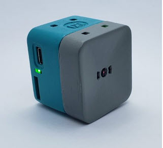
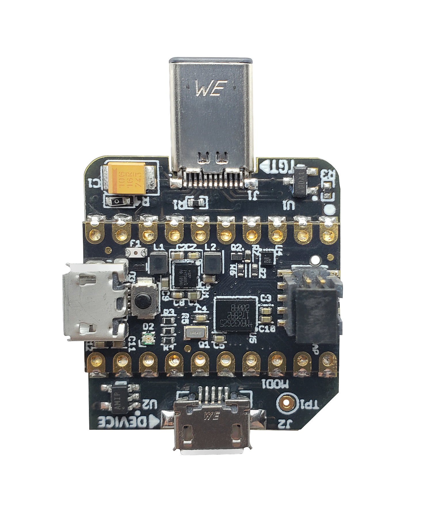
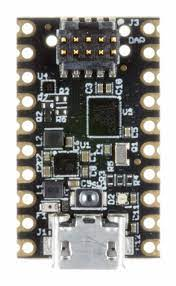
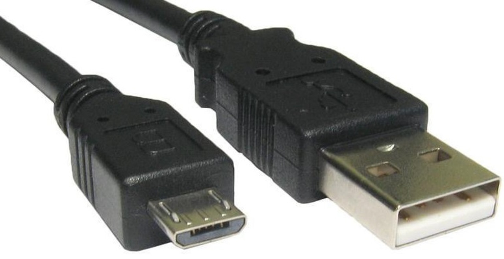
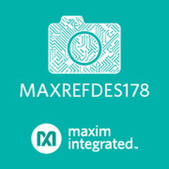

# MAXREFDES178 AI Cube Camera Reference Design

## Introduction
MAXREFDES178 is a reference design based on ADI [MAX78000](https://www.analog.com/en/products/max78000.html#product-overview) Ultra-Low-Power AI processor. It is a cube-shaped device with various sensors and interfaces to implement, test and demonstrate low-power AI applications. The entire design is an open-source project including the hardware. It is possible to build, modify and reprogram existing AI applications in this repository as well as to create brand new applications using new CNN models.

The reference design is a battery-powered device consisting of two electronic boards, a TFT-LCD screen and a Lithium-Ion battery, all assembled in a plastic enclosure. The reference design is equipped with a battery charger and it is possible to recharge the battery using a USB Type-C cable. This enables users to deploy battery-powered AI applications and evaluate them in the field. The device can also operate using an external power source using the same USB Type-C connector.

    

    

## Features
MAXREFDES178 is intended for a wide range of AI application areas but it is mostly intended use for AI vision and AI audio applications. The design has a variety of features to form a complete platform.

* Two MAX78000 Ultra-Low-Power AI Processors
* [MAX32666](https://www.analog.com/en/products/max32666.html) Dual-Core Arm® Cortex-M4 Microcontroller with Bluetooth 5
* MAX20303 PMIC with Battery Charger and Fuel Gauge
* 1.54" 240x240 Capacitive Touch Color TFT Display
* 640x480 Color Image Sensor
* Stereo Line In and Line Out
* MEMS Microphone
* MEMS IMU (3-axis accelerometer and 3-axis gyroscope)
* Flash LEDs
* 4 Programmable User Buttons with dedicated RGB LEDs
* Micro-SD Card Connector
* USB Type-C Connector
* Lithium-Ion Battery

    

## Box Contents

MAXREFDES178 comes with everything required to start development and evaluation including a factory-loaded demo application.

| Item  | Description | Image |
| ------------- | ------------- | ----------- |
| MAXREFDES178 Cube Camera  | Battery powered AI cube camera reference design |  |
| MAXDAP TYPE-C  | [DAPLink](https://daplink.io/) based SWD programmer and debugger with USB Type-C connector as physical interface |  |
| MAX32625PICO | [DAPLink](https://daplink.io/) based SWD programmer and debugger. It is paired with a 10-pin SWD ribbon cable for target processor connection | |
| Micro USB Cable | USB Type-A to Micro USB Type-B Cable |  |

   

Schematics, CAD files and evaluation software for MAXREFDES178 can be found at:
https://www.analog.com/en/design-center/reference-designs/maxrefdes178.html

   

# Android Application For FaceID Demo

The companion Android application for FaceID (Face identification) demo can be downloaded from Google Play Store:

 

<a href="https://play-lh.googleusercontent.com/ulCdrYXKDnKg9xQdXjFmTJ5a0TCnzIaoOYu8J6bhbhbb8UdRizX3Fe7d-XlibHh4hLQ=w240-h480-rw"> 
 
<a href="https://play-lh.googleusercontent.com/ulCdrYXKDnKg9xQdXjFmTJ5a0TCnzIaoOYu8J6bhbhbb8UdRizX3Fe7d-XlibHh4hLQ=w240-h480-rw"> 

   

NEXT : <a href="InputsOutputs.md">Inputs and Outputs</a>

