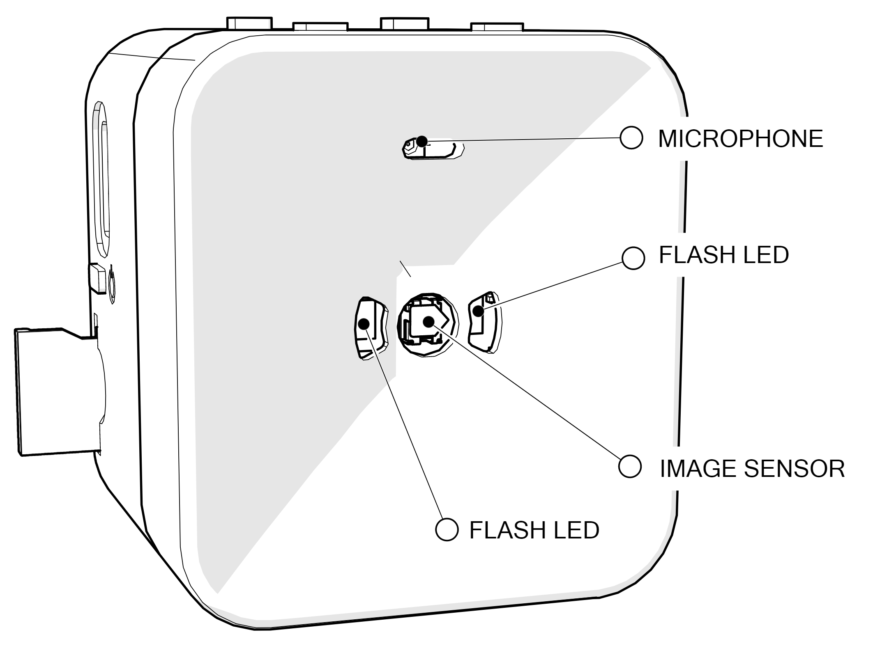
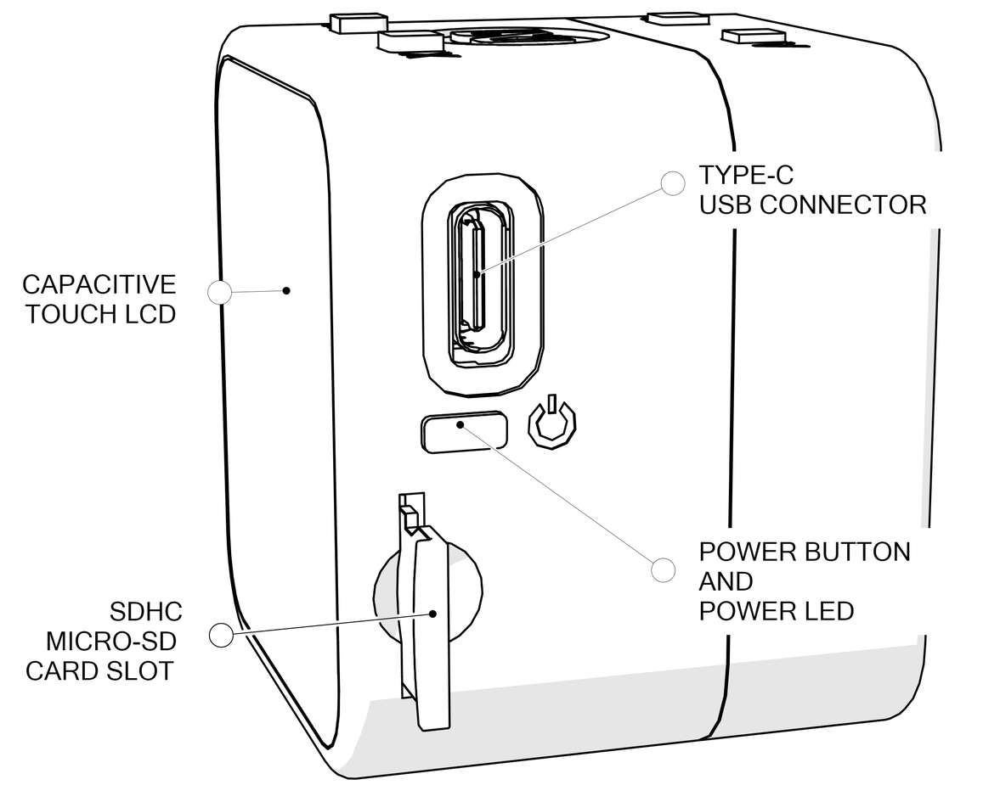
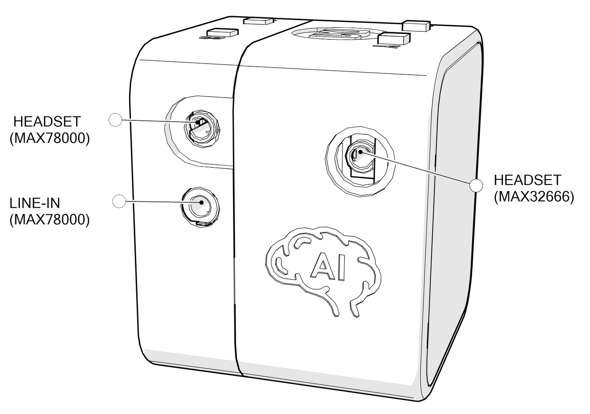
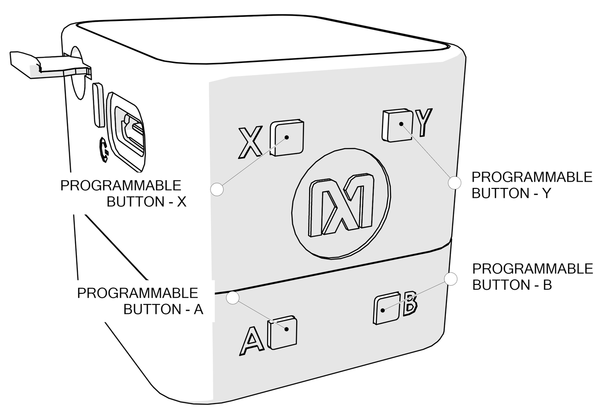
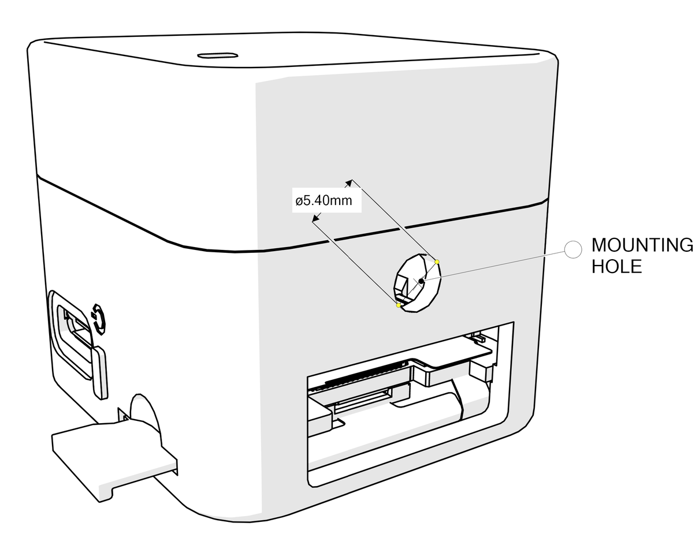

# Inputs and Outputs

## Front Face

On the front face of the cube, there are opening for the camera image sensor, MEMS microphone and two white LEDs for the camera flash.
             

## Right Side

On the right side of the cube, there are two openings for a USB Type-C connector and a Micro SD card slot. The power button with RGB LED is also placed on this side.

|Signal|Designator|Connected Port/Function|
| ------------- | ------------- | ----------- |
|Power Button|SW1 (Connectivity Board)|Power button and user-programmable button.  Connected to the MAX20303 PFN1 input. The MAX20303 PFN2 is the buffered version of this button line and it is connected to MAX32666 P1.9. Internal pullup of this GPIO pin on MAX32666 must be enabled to read the status of this button.|
| RGB Power LED | D1 (Connectivity Board) | MAX20303 LED0 Output: Blue MAX20303 LED1 Output: Red MAX20303 LED2 Output: Green |

   

## Left Side

On the left side of the cube, there are audio connectors for both input and output. The headset (MAX78000) connectors allow connecting headsets equipped with microphones. Both headset connectors are 2.5mm connectors using OMTP (Open Mobile Terminal Platform) standard. The headset connector and Line-In connector on the front cover are connected to MAX9867 audio CODEC which is connected to the MAX78000 Audio processor. The headset connector near the AI logo is operating through the MAX9867 audio CODEC which is connected to the MAX32666 microcontroller.

For all audio connectors, it is required to use a 2.5mm to 3.5mm adapter is needed to use a 3.5mm jack.

   

## Top Side

The user-programmable buttons are located on top of the cube. A and B buttons have dedicated RGB LEDs. The transparent keycaps allow buttons to be illuminated with the desired color and blink pattern. X and Y buttons do not have RGB LEDs.  All buttons are connected through MAX6817 ESD Protected Switch Debouncer ICs.

Two of the buttons are placed on the Connectivity Board, other two are placed on the AI board.

  

|Signal|Designator|Connected Port/Function|
| ------------- | ------------- | ----------- |
| X Button | SW2 (Connectivity Board) |User-programmable button  Connected to MAX32666 P1.6 |
| Y Button | SW3 (Connectivity Board) |User-programmable button  Connected to MAX32666 via MAX7325 I2C IO Expander IC |
| A Button | SW2 (AI Board) |User-programmable button  Connected to the MAX78000 Image (U4) P0.2 |
| B Button | SW3 (AI Board) |User-programmable button  Connected to the MAX78000 Audio (U6) P0.2 |
| A Button RGB LED | D1 (AI Board) | 	RED: MAX78000 Image (U4) P2.0 GREEN: MAX78000 Image (U4) P2.1 BLUE: MAX78000 Image (U4) P2.2 |
| B Button RGB LED | D2 (AI Board) | 	RED: MAX78000 Audio (U6) P2.0 GREEN: MAX78000 Audio (U6) P2.1 BLUE: MAX78000 Audio (U6) P2.2 |

   

## Bottom Side

There is a circular, general-purpose mounting hole at the bottom side of the cube. The diameter of the hole is 5.40mm. There are no screw threads on this hole.

There is also a rectangular window on this side to assemble the enclosure and boards. This window is normally covered with a sticker at the factory.

   
   
      

NEXT : <a href="BlockDiagram.md">Block Diagram</a>

