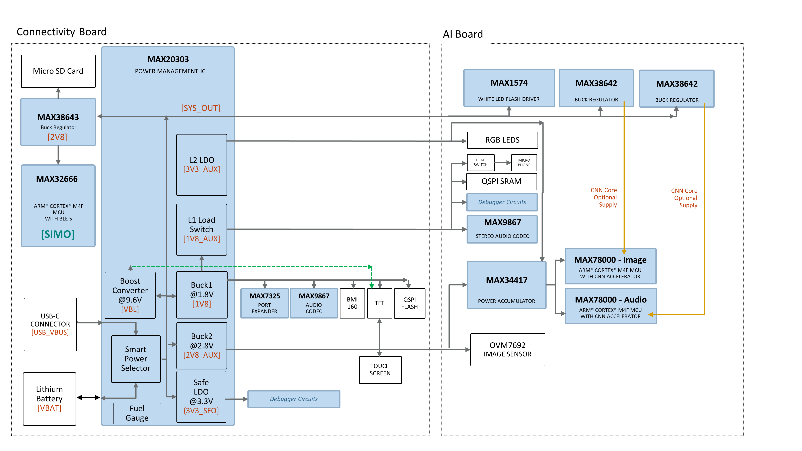

# Power Tree

MAXREFDES178 is mainly powered by [MAX20303](https://www.analog.com/en/products/max20303.html) PMIC.

[MAX20303](https://www.analog.com/en/products/max20303.html) is a highly integraed PMIC with multiple buck, buck-boost converters, LDOs, Li+ battery charger, battery fuel gauge and haptic driver.

  

    
  

The **Safe LDO** of the PMIC is an always-on output when USB cable is plugged. This LDo regulator is utilized to power analog switches and comparators next to the USB Type-C connector. These integrated circuits are used for USB Type-C debugger connection. Please refer to [Debugger Operation](DebuggerOperation) for details.

**Buck1** converter of PMIC is configured to generate 1.8V rail. This rail powers:
* MAX7325 I2C Port Extender
* MAX9867 Stereo Audio Codec
* BMI160 IMU (Accelerometer+Gyroscope)
* TFT LCD 
* QSPI Flash Memory
* MAX6817 Button Debouncer
* Analog Switches for USB Type-C debug operation of AI Board

**Buck2** converter of the PMIC is configured to generate 2.8V_AUX rail. This rail powers:
* TFT LCD 
* Capacitive Touch Screen
* Micro SD Card
* OVM7692 Image Sensor (AI Board)
* MAX78000 - Image (VREGI input of SIMO, via MAX34417 power-accumulator)
* MAX78000 - Audio (VREGI input of SIMO, via MAX34417 power-accumulator)

**LDO1** of PMIC is configured to operate as a load-switch. This load switch controls 1V8_AUX output. When enabled, this rail powers:
* MAX9867 Stereo Audio Codec (AI Board)
* QSPI SRAM (AI Board)
* Microphone (AI Board. Via another load-switch)
* Debugger interface circuits (AI board)

**LDO2** of PMIC generates 3.3V for 3V3_AUX rail. When enabled, this rail powers:
* MAX34417 power accumulator (AI board)
* RGB LEDs (AI board)

**SYS_OUT** of the PMIC is the smart power selector switch output. This rail powers:
* MMAX38643 which is set to 2.8V (2V8 rail)
  * MAX32666 SIMO input is powered from this rail.
  * Micro SD card is powered from this rail.
* MAX1574 White LED Flash Driver (AI board)
* 2x MAX38642 Buck Regulators. (AI Board) These buck regulators are normally disabled. Each regulator can be enabled by the dedicated MAX78000 processor; image our audio. These regulators are connected to CNN supply of the corresonding MAX78000 processor. Normally MAX78000 internal SIMO regulator is sufficient to power CNN block itself. But for very heavy networks, an external regulator might be needed for powering the CNN unit.

**Boost Output** of the PMIC powers TFT LCD backlight. It is set to 9.6V.

**Haptic Output** of the PMIC is not used. But t is accessible on header pins.

[MAX32666](https://www.analog.com/en/products/max32666.html) and [MAX78000](https://www.analog.com/en/products/max78000.html) processors have built-in SIMO (Single Inductor Multiple Output) units to generate necessary voltages with great efficiency. 
   

NEXT : <a href="GettingStarted.md">Getting Started</a>

