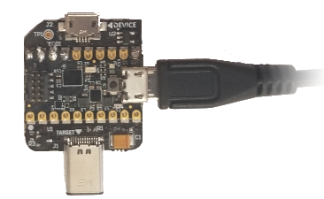
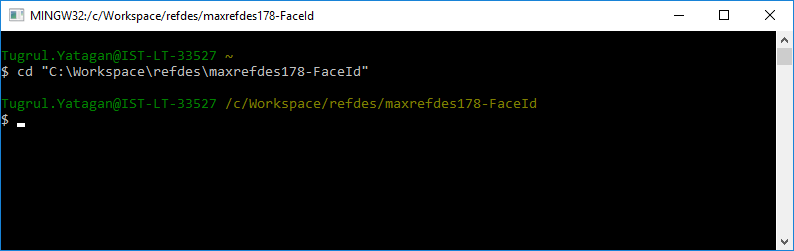
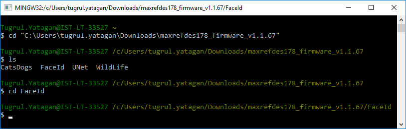
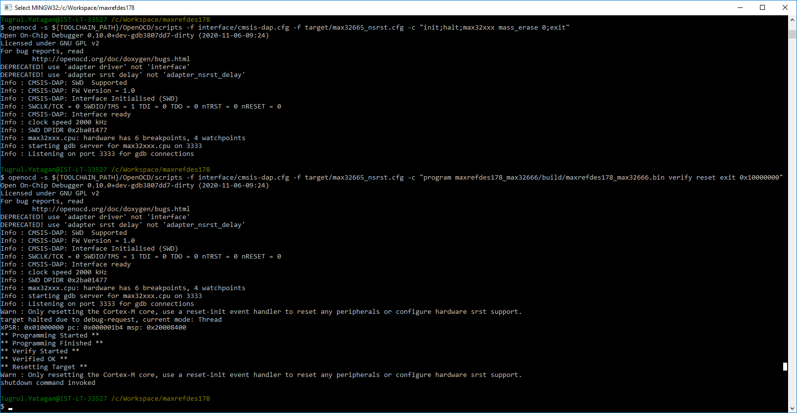
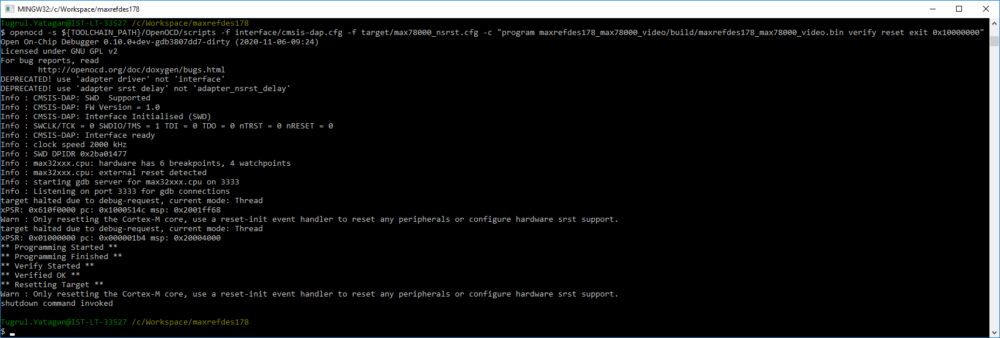

# Programming Demo Firmware Using MINGW on Windows

<br>

Programming MAXREFDES178 means programming three processors one at a time. This can be done using a suitable DAPLink adapter. It is also possible to use an SD-Card and App-Switcher mechanism of MAXREFDES178.

If DAPLink debugger/programmer interface is used, the programming should be done in this order:

<br>

1. Program MAX32666
2. Program MAX78000 Video processor
3. Program MAX78000 Audio processor

<br>

**WARNING:** If you are programming a board that already has MAX78000 Video and MAX78000 Audio firmware, make sure video (FaceID) and audio (KWS) are enabled and running. Start programming MAX78000 Video and MAX78000 Audio firmware first, then MAX32666. MAX78000 Video and MAX78000 Audio firmware go to sleep mode when disabled, which causes interruptions during programming.

* Applications are loaded and run using OpenOCD. This section shows how to do this specifically with MSYS on Windows.

* Connect a USB-Micro-B cable to the MAXDAP-TYPE-C HDK debugger (Pico) port. The Pico on the adaptor must be programmed with the `max32625pico_max32630hsp.bin` DAPLink image.

<br>

<p align="center"></p>

<br>

* To load local builds (the binaries that you build on your PC):

  * Open MinGW console and cd into one of the demo directory:

<br>

<p align="center"></p>

<br>

* To load prebuilded binaries:

  * Download latest `maxrefdes178_firmware.zip` release and extract the content of the zip file.

<br><br>

  |Releases|
  |---|
  |Stable Releases:|
  |https://github.com/MaximIntegratedAI/refdes/releases|
  |Github Actions Builds:|
  |https://github.com/MaximIntegratedAI/refdes/actions/workflows/maxrefdes178.yml|

<br><br>

  * Open MinGW console, cd into the directory where zip is extracted and cd into one of the demo directory:

<br>

<p align="center"></p>

<br>


## Programming MAX32666 Firmware

<br>

1. Connect the debugger/programmer to the MAXREFDES178 Cube Camera

* ### MAXDAP-TYPE-C
    Insert the MAXDAP-TYPE-C into MAXREFDES178 MAX32666 (first debug channel).
    The MAXDAP-TYPE-C and MAXREFDES178 cube camera lens should face **same** direction.

<br>


<p align="center"></p>

<br>

* ### MAXDAP-TYPE-C DUAL
    When MAXDAP-TYPE-C-DUAL is the debugger/programmer, insert to the MAXREFDES178 as shown in the picture. Both components of MAXDAP-TYPE-C-DUAL and MAXREFDES178 cube camera lens are facing **same** direction.
 
   Connect Micro-USB cable to U1 (first debug channel) of MAXDAP-TYPE-C-DUAL. In the picture it is shown that a **white** Micro-USB cable is plugged in. Do **not** plug an USB cable to U2 (second debug chnanel) of MAXDAP-TYPE-C-DUAL. (**Green cable** in the picture shouldn't be connected)


<br>

<p align="center"></p>

<br>

2. Program MAX32666 firmware using provided script:
```
$ run.sh
```

**NOTE:** The script will start openocd with following commands to update the firmware:

```
openocd -s ${TOOLCHAIN_PATH}/OpenOCD/scripts -f interface/cmsis-dap.cfg -f target/max32665_nsrst.cfg -c "init;halt;max32xxx mass_erase 0;exit"
openocd -s ${TOOLCHAIN_PATH}/OpenOCD/scripts -f interface/cmsis-dap.cfg -f target/max32665_nsrst.cfg -c "program maxrefdes178_max32666/build/maxrefdes178_max32666.bin verify reset exit 0x10000000"
```

3. Successful MAX32666 firmware update output:

<p align="center"></p>

4. Press the ‘Y’ button to change the second debug channel to either MAX78000 Video or MAX78000 Audio.

5. A notification at the bottom of the LCD will show the selected target:

<p align="center">

|MAX78000 Video Debug Select|MAX78000 Audio Debug Select|
|----|----|
|||

</p>


<br><br><br>

## Programming MAX78000 Video Firmware

<br>

**WARNING:** If you are programming a board that already has MAX78000 Video firmware, make sure video is enabled and running. MAX78000 Video firmware goes to sleep mode when disabled, which causes interruptions during programming.

**NOTE:** MAX32666 firmware should be loaded before this step.

<br><br>

1. Power cycle the MAXREFDES178 using power button next to the USB Type-C connector.
 
2. Connect the debugger/programmer to the MAXREFDES178 Cube Camera

* ### MAXDAP-TYPE-C
    Insert the MAXDAP-TYPE-C into MAXREFDES178 second debug channel.
    The MAXDAP-TYPE-C and MAXREFDES178 cube camera lens should face **opposite** direction.

<br>


<p align="center"></p>

<br>

* ### MAXDAP-TYPE-C DUAL
    When MAXDAP-TYPE-C-DUAL is the debugger/programmer, insert to the MAXREFDES178 as shown in the picture. Both components of MAXDAP-TYPE-C-DUAL and MAXREFDES178 cube camera lens are facing **same** direction.
 
   Connect Micro-USB cable to U2 (second debug channel) of MAXDAP-TYPE-C-DUAL. In the picture it is shown that a **green** Micro-USB cable is plugged in. Do **not** plug an USB cable to U2 (first debug chnanel) of MAXDAP-TYPE-C-DUAL. (**White** cable in the picture shouldn't be connected)

<br>

<p align="center"></p>

<br>

<div style="margin-left: 0; background-color: #dfd;" >

**WARNING:** Connecting MAXDAP-TYPE-C or MAXDAP-TYPE-C-DUAL adaptor with wrong direction may cause the MAX78000 to become unresponsive and may require to open the camera and use the procedure described later to recover.

</div>

<br>

3. Select **MAX78000 Video** target with button ‘Y’. **MAX78000 Video** will disable sleep mode for 30 seconds to prevent interruptions during programming. Be quick after selecting target with button ‘Y’.

<p align="center">

</p>

4. Program MAX78000 Video firmware using provided script:

```
$ run.sh
```

**NOTE:** The script will start openocd with following commands to update the firmware:

```
openocd -s ${TOOLCHAIN_PATH}/OpenOCD/scripts -f interface/cmsis-dap.cfg -f target/max78000_nsrst.cfg -c "program maxrefdes178_max78000_video/build/maxrefdes178_max78000_video.bin verify reset exit 0x10000000"
```


<br>

5. Successful MAX78000 Video firmware update output:

<p align="center"></p>


**NOTE:** If the firmware update fails or OpenOCD crashes repeatedly and you were unable to program the video or audio firmware, please erase the video or audio firmware using the MAX32625PICO Debugger as described in the “Recovering/Erasing Video or Audio Firmware Using MAX32625PICO” section.

<br><br><br>

## Programming MAX78000 Audio Firmware
<br>

**NOTE:** MAX32666 firmware should be loaded before this step.

<br>

1. Power cycle the MAXREFDES178 using power button next to the USB Type-C connector.

2. Connect the debugger/programmer to the MAXREFDES178 Cube Camera

* ### MAXDAP-TYPE-C
    Insert the MAXDAP-TYPE-C into MAXREFDES178 second debug channel.
    The MAXDAP-TYPE-C and MAXREFDES178 cube camera lens should face **opposite** direction.

<br>


<p align="center"></p>

<br>

* ### MAXDAP-TYPE-C DUAL
    When MAXDAP-TYPE-C-DUAL is the debugger/programmer, insert to the MAXREFDES178 as shown in the picture. Both components of MAXDAP-TYPE-C-DUAL and MAXREFDES178 cube camera lens are facing **same** direction.
 
   Connect Micro-USB cable to U2 (second debug channel) of MAXDAP-TYPE-C-DUAL. In the picture it is shown that a **green** Micro-USB cable is plugged in. Do **not** plug an USB cable to U2 (first debug chnanel) of MAXDAP-TYPE-C-DUAL. (**White** cable in the picture shouldn't be connected)

<br>

<p align="center"></p>

<br>

<div style="margin-left: 0; background-color: #dfd;" >

**WARNING:** Connecting MAXDAP-TYPE-C or MAXDAP-TYPE-C-DUAL adaptor with wrong direction may cause the MAX78000 to become unresponsive and may require to open the camera and use the procedure described later to recover.

</div>

<br><br>

3. Select **MAX78000 Audio** target with button ‘Y’. **MAX78000 Audio** will disable sleep mode for 30 seconds to prevent interruptions during programming. Be quick after selecting target with button ‘Y’.

<p align="center">

</p>

4. Program MAX78000 Audio firmware using provided script:

```
$ run.sh
```

**NOTE:** The script will start openocd with following commands to update the firmware:

```
openocd -s ${TOOLCHAIN_PATH}/OpenOCD/scripts -f interface/cmsis-dap.cfg -f target/max78000_nsrst.cfg -c "program maxrefdes178_max78000_audio/build/maxrefdes178_max78000_audio.bin verify reset exit 0x10000000"
```
<br>

5. Successful MAX78000 Audio firmware update output:

<br>

<p align="center"></p>


**NOTE:** If the firmware update fails or OpenOCD crashes repeatedly and you were unable to program the video or audio firmware, please erase the video or audio firmware using the MAX32625PICO Debugger as described in the “Recovering/Erasing Video or Audio Firmware Using MAX32625PICO” section.

<br><br><br>


<br><br><br>
<div class="nextpage" style="margin-left: 0; margin-right: auto; text-align: right; background-color: #dfd;" >
NEXT : <a href="DevelopmentEnvironment.md">Development Environment</a>
</div>


